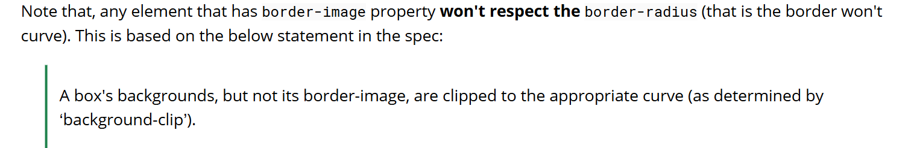
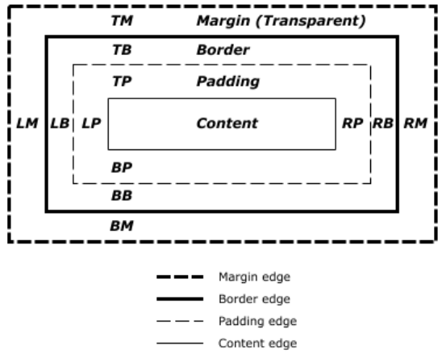
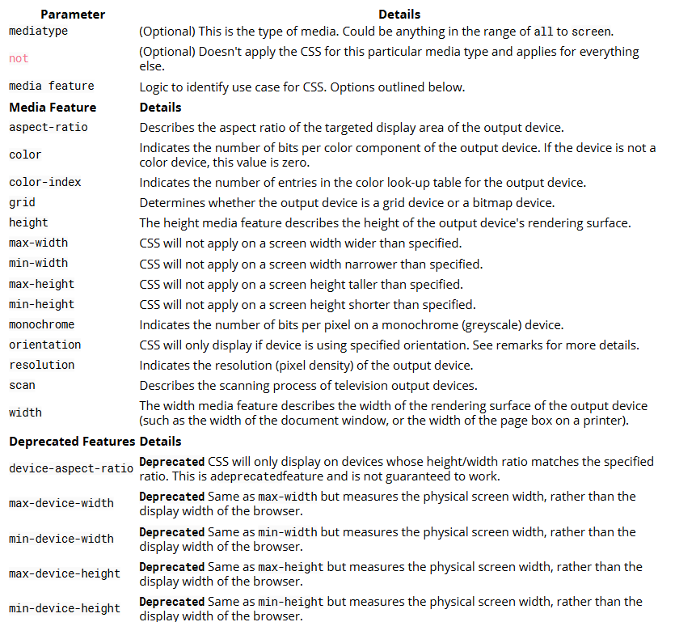
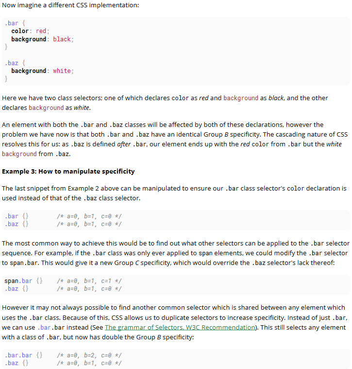
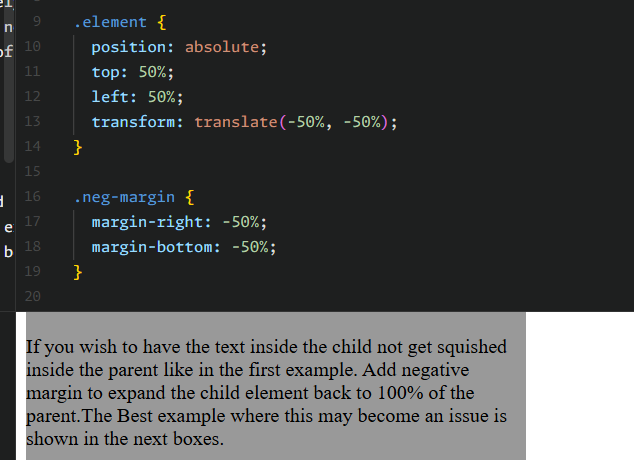

# Question

- CSS at-rule?
- @import?
```css
@import '/additional-styles.css';
@import 'https://fonts.googleapis.com/css?family=Lato';
@import '/print-styles.css' print;
@import url('landscape.css') screen and (orientation:landscape);
```
- `list-style-type: symbols();`? symbols()?
- url()?
- all selectors in css?
- css4?
- specificity?
- practice :pseudo-class?
- practice ::pseudo-elemets?
- `::first-letter/::first-line`?
- deg/grad/rad/turn ?
- color() ? rgb() ? attr() ? calc() ? translate() ?
- float? clear?
- allowed values of all css properties ?
- scroll ?
- practive border-image ?
- ?
- overflow-clip ?
- border block? inline? start? end?
- types of media ?
- what are @... ?
- practice @media, media-type, media-feature ?
- vendor prefix ?
- what is this ?
```js
<!--[if lt IE 9]>
<script
   src="respond.min.js">
</script>
<![endif]-->
```
- frowned ?
- practice float ? and overflow ?
- inline, inline-block, block, flex, grid, table, table-cell ?
- layouts using css ?
- practice grid ?
- min-content, fit-content, max-content ?
- practice typography? 
- practice flexbox?
- transparent, opaque, grayscale, vivid

# Note

## Version

- css1 - 1996-12-17
- css2 - 1998-05-12
- css3 - 2015-10-13

## Connecting CSS

1. External - `<link rel="stylesheet" href="style.css >"` - cached
2. Internal - `<style>...</style>`
3. Import - `<style> @import url('/css/styles.css'); </style>`
4. Inline - `<div style="..."></div>`- use not used more
5. Using JS - `el.style. ... = ...` - ower camel case style
6. Query - `$('#element').css('margin', '5px');`

## Structure

- Structure - selector {declaration} - `h1{}` 
- Multiple Selector: `p, .blue, #first, div span{ color : blue }`
- Multiple Values(Property List): `span { text-shadow: yellow 0 0 3px, green 4px 4px 10px; }`
- Comment - `/* ... */`

## All Selectors

1. `*` - universal selector(all elements)
2. `div` - tag selector(all `<div>` elements)
3. `.blue` - class selector(all elements with class `blue`)
4. `.blue.red` - compound selector(all elements with class `blue` and `red`)
5. `#headline` - id selector(an element with id `headline`)
6. `::pseudo-element`
7. `:lang(en)` - Element that matches `:lang` declaration, `<span lang="en">`
8. attribute selector(attribute value can have ''/""/no quote(not recommended))
    1. `[attr]` - With attribute attr
        - `<div attr>`
    2. `[attr='val']` - Where attribute attr has value val
        - `<div attr="val">`
    3. `[attr~='val']` - Where val appears in the whitespace-separated list of attr
        - `<div attr="val val2 val3">`
    4. `[attr^='val']` - Where attr's value begins with val
        - `<div attr="val1 val2">`
    5. `[attr$='val']` - Where the attr's value ends with val
        - `<div attr="sth aval">`
    6. `[attr*='val']` - Where attr contains val anywhere
        - `<div attr="somevalhere">`
    7. `[attr|='val']`- Where attr's value is exactly val, or starts with val and immediately followed by - (U+002D)
        - `<div attr="val-sth etc">`
    8. `[attr='val' i]` - Where attr has value val, ignoring val's letter casing
        - `<div attr="VAL">`
9. Combinators
    1. `div span` - Descendant selector (all `<span>s` that are descendants of a `<div>`)
    2. `div > span` - Child selector (all `<span>s` that are a direct child of a `<div>`)
    3. `a ~ span`- General Sibling selector (`<span>s` that are siblings after an `<a>`) != `span ~ a`
    4. `a + span` - Adjacent Sibling selector (`<span>s` that are immediately after an `<a>`)
10. `:pseudo-class` - keywords - type(state, dynamic, structural, target, negation, lang)
    - `:active` - Applies to any element being activated (i.e. clicked) by the user.
    - `:any` - Allows you to build sets of related selectors by creating groups that the included items will match. This is an alternative to repeating an entire selector.
    - `:target` - Selects the current active `#news` element (clicked on a URL containing that anchor name)
    - `:checked` - Applies to radio, checkbox, or option elements that are checked or toggled into an "on" state.
    - `:default` - Represents any user interface element that is the default among a group of similar elements.
    - `:disabled` - Applies to any UI element which is in a disabled state.
    - `:empty` - Applies to any element which has no children.
    - `:enabled` - Applies to any UI element which is in an enabled state.
    - `:first` - Used in conjunction with the `@page` rule, this selects the first page in a printed document.
    - `:first-child` - Represents any element that is the first child element of its parent.
    - `:first-of-type` - Applies when an element is the first of the selected element type inside its parent. This may or may not be the first-child.
    - `:focus` - Applies to any element which has the user's focus. This can be given by the user's keyboard, mouse events, or other forms of input.
    - `:focus-within` - Can be used to highlight a whole section when one element inside it is focused.It matches any element that the :focus pseudo-class matches or that has a descendant focused.
    - `:full-screen` - Applies to any element displayed in full-screen mode. It selects the whole stack of elements and not just the top level element.
    - `:hover` - Applies to any element being hovered by the user's pointing device, but not activated.
    - `:indeterminate` - Applies radio or checkbox UI elements which are neither checked nor unchecked, but are in an indeterminate state. This can be due to an element's attribute or DOM manipulation.
    - `:in-range` - The `:in-range` CSS pseudo-class matches when an element has its value attribute inside the specified range limitations for this element. It allows the page to give a feedback that the value currently defined using the element is inside the range limits.
    - `:invalid` - Applies to `<input>` elements whose values are invalid according to the type specified in the `type=` attribute.
    - `:lang` - Applies to any element who's wrapping `<body>` element has a properly designated `lang=` attribute. For the pseudo-class to be valid, it must contain a valid two or three letter language code.
    - `:last-child` - Represents any element that is the last child element of its parent.
    - `:last-of-type` - Applies when an element is the last of the selected element type inside its parent. This may or may not be the last-child.
    - `:left` - Used in conjunction with the `@page` rule, this selects all the left pages in a printed document.
    - `:link` - Applies to any links which haven't been visited by the user.
    - `:not()` - Applies to all elements which do not match the value passed to (:not(p) or :not(.class-name)) for example. It must have a value to be valid and it can only contain one selector. However, you can chain multiple :not selectors together.
    - `:nth-child` - Applies when an element is the n-th element of its parent, where n can be an integer, a mathematical expression (e.g n+3) or the keywords odd or even.
    - `:nth-of-type` - Applies when an element is the n-th element of its parent of the same element type, where n can be an integer, a mathematical expression (e.g n+3) or the keywords odd or even.
    - `:only-child` - The :only-child CSS pseudo-class represents any element which is the only child of its parent. This is the same as :first-child:last-child or :nth-child(1):nth-last-child(1), but with a lower specificity.
    - `:optional` - The :optional CSS pseudo-class represents any element that does not have the required attribute set on it. This allows forms to easily indicate optional fields and to style them accordingly.
    - `:out-of-range` - The :out-of-range CSS pseudo-class matches when an element has its value attribute outside the specified range limitations for this element. It allows the page to give a feedback that the value currently defined using the element is outside the range limits. A value can be outside of a range if it is either smaller or larger than maximum and minimum set values.
    - `:placeholder-shown` - Experimental. Applies to any form element currently displaying placeholder text.
    - `:read-only` - Applies to any element which is not editable by the user.
    - `:read-write` - Applies to any element that is editable by a user, such as `<input>` elements.
    - `:right` - Used in conjunction with the `@page` rule, this selects all the right pages in a printed document.
    - `:root` - matches the root element of a tree representing the document.
    - `:scope` - CSS pseudo-class matches the elements that are a reference point for selectors to match against.
    - `:target` - Selects the current active #news element (clicked on a URL containing that anchor name)
    - `:visited` - Applies to any links which have has been visited by the user.

- **NOTE** - The `:visited` pseudoclass can't be used for most styling in a lot of modern browsers anymore because it's a security hole. See this link for reference

```css
.important {
    color: orange;
}
.warning {
    color: blue;
}
.warning.important {
    color: red;
}

#element { ... } /* High specificity will override many selectors */
[id="element"] { ... } /* Low specificity, can be overridden easily */
```


## Colors

1. color keywords - red/Blue/GREEN/etc - without quotes
2. hex code - #RRGGBB / #RGB - range(0-f) - case-insensitive - number of colors represented are 256 ^ 3 or 16,777,216
3. rgb() - rgb(red, green, blue) - values from 0 to 255 or from 0% to 100%
4. rgba() - rgba(red, green, blue, alpha) - alpha(0.0 - 1.0)
5. hsl() - hue(0->360) ("which color"), saturation(0%->100%) ("how much color"), lightness(0%->100%) ("how much white")
6. hsla() - hsl(hsl, alpha) - alpha(.0, 1)
7. `transparent` - rgba(0, 0, 0, 0);

- `currentColor`- returns the computed color value of the current element
```css
div {
   color: red;    
   border: 5px solid;
   box-shadow: 0 0 5px currentColor;
}
```

```css
.parent-class {
    color: blue;
}
.parent-class .child-class {
    border-color: currentColor;
}
```

- **NOTE** - border color will be same as color
- **NOTE** - `opacity: 0.0->1.0` - to change opacity of element

## gradients

- Gradients are new image types, i.e. used with background-image

1. inear-gradient( direction?, color-stop?-1, color-stop?-2, ...)
    - direction - optional - define end of gradient
        - toward direction - to top/to right/to left/to bottom(default)
        - combination diagonal -  to top left/to top right/to bottom left/ to bottom right
        - an angle - 90deg/grad/rad/turn. Angle starts from to top and rotates clockwise
    - color-stop-n
        - list of color
        - optionally followed by length or percentage
2. repeating-linear-gradient() - repeat after last color ends - see style.css
3. radial-gradient( shape? size? position?, color-stop?-1, color-stop?-2, ...)
    - shape - circle/eclipse(default)
    - size - closest-side/furthest-side/closest-corner/furthest-corner
    - position - define start - at left/right/top/bottom/top left/...
4. repeating-radial-gradient() - repeat after last color stops from start again..

## Background

1. `background-color: transparent` - color value
2. `background-image: none` - url() | initial | inherit | any-gradient
3. `background-size: both | x y` - px | % | auto(keep the image's aspect ratio) | contain | cover
4. `background-repeat: no-repeat` - repeat | repeat-x | repeat-y
5. `background-position: x y` - px | % | center | left | right | top | bottom
6. `background-origin: padding-box` - border-box | content-box
7. `background-attachment: scorll` - fixe | local
8. `background-clip:`?
9. `background-blend-mode: normal` - multiply | screen | overlay | darken | lighten | color-dodge |
saturation | color | luminosity

### background shorthand

- The order of the values does not matter and every value is optional

- `background: [<background-image>] [<background-color>]  [<background-position>]/[<background-size>] [<background-repeat>] [<background-origin>] [<background-clip>] [<background-attachment>] [<initial|inherit>];`

- example - `background: #000000 url("picture.png") top left / 600px auto no-repeat;`

1. `background-image` - Background image to use
2. `background-color` -  Background color to apply
3. `background-position` - Background image's position
4. `background-size` - Background image's size
5. `background-repeat` - How to repeat background image
6. `background-origin` - How the background is positioned (ignored when background-attachment is fixed)
7. `background-clip` - How the background is painted relative to the content-box, border-box, or the padding-box
8. `background-attachment` - How the background image behaves, whether it scrolls along with its containing block or has a fixed position within the viewport
9. `background-position-x`
10. `background-position-y`
11. `background-blend-mode`

### NOTE

- `background` shorthand should be defined before any longhand property as it override the behaviour
- multiple background - images will stack according to their order with the first declared image on top of the others and so on
```css
#mydiv {
  background-image: url(img_1.png), /* top image */
                    url(img_2.png), /* middle image */
                    url(img_3.png); /* bottom image */
  background-position: right bottom,
                       left top,
                       right top;
  background-repeat: no-repeat,
                     repeat,
                     no-repeat;
}

#mydiv {
  background: url(img_1.png) right bottom no-repeat,
              url(img_2.png) left top repeat,
              url(img_3.png) right top no-repeat;
}

```

## Centering

1. using flexbox
2. using margin: 0 auto; (horizontal)
3. using text-align (horizontal for inline in block parent)
4. using vertical-align (vertical for inline)
5. using position: absolute with top=left=right=bottom=0 or css transform or calc(50% - w / 2)
6. using line-height (vertical for single line)
7. using display: table and table-cell (centering in relation to another item)
    - The outer container should have display: table;
    - The inner container
        - should have display: table-cell;
        - should have vertical-align: middle;
        - should have text-align: center;
    - The content box
        - should have display: inline-block;
8. using grid
9. ghost element technique (Michał Czernow's hack)

```css
/* This parent can be any width and height */
.block {
  text-align: center;
  /* May want to do this if there is risk the container may be narrower than the element inside */
  white-space: nowrap;
}
 
/* The ghost element */
.block:before {
  content: '';
  display: inline-block;
  height: 100%;
  vertical-align: middle;
  /* There is a gap between ghost element and .centered,
  caused by space character rendered. Could be eliminated by
  nudging .centered (nudge distance depends on font family),
  or by zeroing font-size in .parent and resetting it back
  (probably to 1rem) in .centered. */
  margin-right: -0.25em;
}
/* The element to be centered, can also be of any width and height */
.centered {
  display: inline-block;
  vertical-align: middle;
  width: 300px;
  white-space: normal; /* Resetting inherited nowrap behavior */
}
```

## Box Model

- content-box - Width and height of the element only includes content area. DEFAULT
- padding-box - Width and height of the element includes content and padding.
- border-box - Width and height of the element includes content, padding and border.



## Margin and padding

- `margin: <top> <right> <bottom> <left>`
- `margin: <top-bottom> <left-right>`
- `margin: <top> <left-right> <bottom>`
- `margin: <all>`
- margin-(left | right | top | bottom)
- margin-inline
- margin-block

- values: +ve | 0 | -ve | auto | units | % | initial | inherit

- padding shorthand is same as margin
- padding long hand are also same

- **NOTE** - When two margins are touching each other vertically, they are collapsed and larger
margin will determine the spacing between the elements in sibling, parent-child, any touching vertical margins. When two margins touch horizontally, they do not collapse
- **NOTE** - if element is block and has explicit width. margin-inline: auto will make is horizontal center
- **NOTE** - percentage value are relative to the parentWidth even for top and bottom
- **NOTE** - no negative values

## Border and Outline

- `border: <width> <style> <color>` - short hand
- `border-width: units`
- `border-style: enum`
- `border-color: color`
- `border-[top | right | bottom | left]: <width> <style> <color>` - for each side also has long hand

### border style

- `border-style: <all>`
- `border-style: <top> <right> <bottome> <left>`
- same for width and color

- values: none | solid | dashed | dotted | double | groove | hidden | ridge | inset | outset | unset | inherit | initial

- none(lowest priority) and hidden(highesh priority) helpful in table conflict

### border radius

- changes the shape of box modela

- `border-radius: <all>`
- `border-radius: <tl-br> <tr-bl>`
- `border-radius: <tl> <tr> <br> <bl>`
- `border-radius: <hr-tl-br> <vr-tr-bl> / <vr-tl> <vr-tr> <vr-br> <vr-bl>` - horizontal then vertical separated by `/`
- `border-top-left-radius: <hr-vr>`
- `border-top-left-radius: <hr> <vr>`

- values: units | %

- **NOTE** - every corner has two values total 8 value
- **NOTE** - by setting it half i.e. 50% circle is created

### Border Collapse

- `border-collapse: separate | collapse`
- `border-spacing: units` - only if border-collapse is separate

- mostly used with table, display: table | inline-table

### border image

- `border-image: <source> <slice> <repeat>` - shorthand
- `border-source: none | url()` - image path
- `border-slice: ` - Specifies the offset that is used to divide the image into nine regions (four corners, four edges and a middle)
- `border-repeat: repeat | round | space | stretch` - Specifies scaling

- **NOTE** - can use gradient
- **NOTE** - the gradient is applied to the entire box and then the colors are masked from the padding andcontent areas

### Multipe borders

1. using border + outline
2. using border + box-shadow
3. using border + ::before + ::after

### Outline

- outline goes around the element outside the border

- `outline: <width> <style> <color>`
- `outline-width: units`
- `outline-style: enum`
- `outline-color: color`
- `outline-offset: units`

- **NOTE** - great for debugging as it do not take any space in box model
- **NOTE** - can be non-rectangular
- **NOTE** - don't have radius

## Overflow

- `overflow: auto | hidden | scroll | visible | clip` - short hand
- `overflow-x: ` - horizontal
- `overflow-y: ` - vertical
- `overflow-wrap: anywhere | break-word | normal` - used to define whethe to break-word or not(normal), anywhere?
- `overflow-anchor: `
- `overflow-block: `
- `overflow-clip-margin: `
- `overflow-inline: `

- **NOTE** - auto goes from visible to scroll
- **NOTE** - scroll may show both scrollbars
- **NOTE** - Using the overflow property with a value different to visible will create a new block formatting context. This is useful for aligning a block element next to a floated element

## Media Queries



- Media queries allow one to apply CSS rules based on the type of device / media (e.g. screen, print or handheld) called media type.
- Additional aspects of the device are described with media features such as the availability of color or viewport dimensions.

```css
@media [all | mediatype] and (media-feature) {
    /* One or more CSS rules to apply when the query is satisfied */
}

@media print {
    h1 {
        color: orange;
    }
}

@media not print {}
@media only screen {}
@media screen and (max-width: 600px) {}
@media (orientation: portrait) {}

@media only screen and (min-width: 300px) and (max-width: 767px) {
    /* Styles in this block are only applied if the screen size is atleast 300px wide, but no more than 767px */
}
```

- **NOTE** - If media-type not defined it implicit to all

### List of media type

- all        - Apply to all devices
- screen     - Default computers
- print      - Printers in general. Used to style print-versions of websites
- handheld   - PDA's, cellphones and hand-held devices with a small screen
- projection - For projected presentation, for example projectors
- aural      - Speech Systems
- braille    - Braille tactile devices
- embossed   - Paged braille printers
- tv         - Television-type devices
- tty        - Devices with a fixed-pitch character grid. Terminals, portables.

### Media Queries for Retina and Non RetinaScreens

```css
/* ----------- Non-Retina Screens ----------- */
@media screen
  and (min-width: 1200px)
  and (max-width: 1600px)
  and (-webkit-min-device-pixel-ratio: 1) {
}
/* ----------- Retina Screens ----------- */
@media screen
  and (min-width: 1200px)
  and (max-width: 1600px)
  and (-webkit-min-device-pixel-ratio: 2)
  and (min-resolution: 192dpi) {
}
```

### setting meta viewport

- `<meta name="viewport" content="width=device-width,initial-scale=1">`

- View-port is the width of the device itself. If your screen resolution says the resolution is 1280 x 720, your view-port width is "1280px".
- More often many devices allocate different pixel amount to display one pixel. For an example iPhone 6 Plus has 1242 x 2208 resolution. But the actual viewport-width and viewport-height is 414 x 736. That means 3 pixels are used to create 1 pixel.
- But if you did not set the meta tag correctly it will try to show your webpage with its native resolution which results
in a zoomed out view (smaller texts and images)

### setting media using tag

- `<link rel="stylesheet" media="min-width: 600px" href="example.css" />` - This stylesheet is still downloaded but is applied only on devices with screen width larger than 600px

## Float

- `float: none | left | right | inline-start | inline-end | initial | inherit`
- `clear: none | both | left  | right        | initial    | inherit` - doen't allow float on specified side

1. float an image within text causing text wrap around an image.
2. make block elements inline

- **NOTE** - Setting overflow value to hidden,auto or scroll to an element, will clear all the floats within that element

### clearify

```css
.cf:before,
.cf:after {
    content: " ";
    display: table;
}
.cf:after {
    clear: both;
}
```

### Three column layout

```css
.wrapper {
  width:600px;
  background-color:pink;
  padding:20px;
  /* Floated elements don't use any height. Adding "overflow:hidden;" forces the
     parent element to expand to contain its floated children. */
  overflow:hidden;
}
.left-sidebar {
  width:150px;
  background-color:blue;
  float:left;
}
.content {
  width:300px;
  background-color:yellow;
  float:left;
}
.right-sidebar {
  width:150px;
  background-color:green;
  float:right;
}
```

## Typography

- `font-style: normal | italic | oblique`
- `font-variant: normal | small-caps`
- `font-weight: normal | lighter | bold | bolder | 100-900`
- `font-size: units`
- `line-height: units`
- `font-family: [font-face1] [font-face2] [...]`
- `color: [color]`
- `text-align: start | end | left | right | center | justify`
- `text-decoration: [line] [style] [color]`;
    - `text-decoration-line: line-through | none | overline | underline`
    - `text-decoration-style: dashed | dotted | double | none | solid | wavy`
    - `text-decoration-color: color`
- `quote: "<<" ">>"`
- `direction: ltr | rtl`
- `writing-mode: horizontal-tb | sideways-lr | sideways-rl | vertical-lr | vertical-rl`
- `text-overflow: clip | ellipsis`
- `text-shadow: horizontal-offset vertical-offset blur color`
- `text-transform: capitalize | lowercase | none | uppercase;`
- `text-indent: unit`
- `letter-spacing: normal | -ve | +ve`
- `word-spacing: normal | -ve | +ve`

- `font: [font-style] [font-variant] [font-weight] [font-size/line-height] [font-family]`

- **NOTE** - names with more than one word such as "Segoe UI" need to have single or double quotes around them

## Flexbox

- `display: flex` - set display to flex
- `align-items: baseline | center | end | first baseline | flex-end | flex-start | last baseline | normal | safe | self-end | self-start | start | stretch | unsafe` - align the elements along the axis other than the one specified by flex-direction
- `justify-content: baseline | center | end | first baseline | flex-end | flex-start | last baseline | left | right | safe | space-around | space-between | space-evenly | start | stretch | unsafe` - justify the elements along the axis specified by flex-direction
- `flex-direction: column | column-reverse | row | row-reverse`
- `flex: auto | none | content | units`


## Specificity and Cascading

### Specificity

- A > B > C

- A - id selectors - #foo
- B - class selectors attribute selectors pseudo-classes - .bar, [title], [colspan="2"], :hover, :nth-child(2)
- c type selectors pseudo-elements - div, li, ::before, ::first-letter

```css
#foo #baz {}      /* a=2, b=0, c=0 */
#foo.bar {}       /* a=1, b=1, c=0 */
#foo {}           /* a=1, b=0, c=0 */
.bar:hover {}     /* a=0, b=2, c=0 */
div.bar {}        /* a=0, b=1, c=1 */
:hover {}         /* a=0, b=1, c=0 */
[title] {}        /* a=0, b=1, c=0 */
.bar {}           /* a=0, b=1, c=0 */
div ul + li {}    /* a=0, b=0, c=3 */
p::after {}       /* a=0, b=0, c=2 */
*::before {}      /* a=0, b=0, c=1 */
::before {}       /* a=0, b=0, c=1 */
div {}            /* a=0, b=0, c=1 */
* {}              /* a=0, b=0, c=0 */
```

- CSS allows us to duplicate selectors to increase specificity
- example - 
- `!important` - override all previous values for that element and make it has highest specificity, should be avoided, used only with generic css
```css
#mydiv {
    font-weight: bold !important;    /* This property won't be overridden
                                       by the rule below */
}
```
- When creating your CSS style sheet, you should maintain the lowest specificity as possible

### Cascading

- same specificity will be overriden by last modified value, i.e. last one loaded overrides any earlier ones

#### CSS Loading order

Styles are read from the following sources, in this order:

1. User Agent stylesheet (The styles supplied by the browser vendor)1.
2. User stylesheet (The additional styling a user has set on his/her browser)2.
3. Author stylesheet (Author here means the creator of the webpage/website)3.
    - Maybe one or more .css files
    - In the `<style>` element of the HTML document
4. Inline styles (In the style attribute on an HTML element)4.

The browser will lookup the corresponding style(s) when rendering an element

When multiple rule sets are found with conflicting settings, first the Specificty rules, and then the Cascading rules
are used to determine what style to use

- Selector specificity always take precedence.
- Stylesheet order break ties.
- Inline styles trump everything

## Lendth Units

- %    - Define sizes in terms of parent objects or current object dependent on property ( Parent Container`s width ) * ( Percentage(%) ) = Output
- em   - Relative to the font-size of the element (2em means 2 times the size of the current font)
- rem  - Relative to font-size of the root element
- vw   - Relative to 1% of the width of the viewport*
- vh   - Relative to 1% of the height of the viewport*
- vmin - Relative to 1% of viewport's* smaller dimension
- vmax - Relative to 1% of viewport's* larger dimension
- cm   - centimeters
- mm   - millimeters
- in   - inches (1in = 96px = 2.54cm)
- px   - pixels (1px = 1/96th of 1in)
- pt   - points (1pt = 1/72 of 1in)
- pc   - picas (1pc = 12 pt)
- s    - seconds (used for animations and transitions)
- ms   - milliseconds (used for animations and transitions)
- ex   - Relative to the x-height of the current font
- ch   - Based on the width of the zero (0) character
- fr   - fractional unit (used for CSS Grid Layout)

- `width: fit-content | auto | max-content | min-content | 0% | 0cap | 0ch | 0cm | 0cqb | 0cqh | 0cqh | 0cqi | 0cqmax | 0cqmin | 0cqmin | 0cqw | 0dvb | 0dvh | 0dvi | 0dvw | 0em | 0ex | 0fr | 0ic | 0in | 0lh | 0lvb | 0lvh | 0lvi | 0lvw | 0mm | 0pc | 0pt | 0px | 0q | 0rcap | 0rch | 0rem | 0rex | 0ric | 0rlh | 0svb | 0svh | 0svi | 0svw | 0vb | 0vh | 0vi | 0vmax | 0vmin | 0vw`

## Chapter 21: Pseudo elements


## Chapter 22
## Chapter 23
## Chapter 24
## Chapter 25
## Chapter 26
## Chapter 27
## Chapter 28
## Chapter 29
## Chapter 30
## Chapter 31
## Chapter 32
## Chapter 33
## Chapter 34
## Chapter 35
## Chapter 36
## Chapter 37
## Chapter 38
## Chapter 39
## Chapter 40
## Chapter 41
## Chapter 42
## Chapter 43
## Chapter 44
## Chapter 45
## Chapter 46
## Chapter 47
## Chapter 48
## Chapter 49
## Chapter 50
## Chapter 51
## Chapter 52
## Chapter 53
## Chapter 54
## Chapter 55
## Chapter 56

## Styling List `<li>`

1. `list-style: disc outside none` - shorthand
2. `list-style-type: disc` - armenian/circle/decimal/decimal-leading-zero/disc/georgian/lower-(alpha/greek/latin/roman)/none/square/symbols()/upper-(alpha/latin/roman)
3. `list-style-image: none` - none/url();
4. `list-style-position: outside` - inside/outside

## styling range element (see style.css)

- Thumb - `input[type=range]::-webkit-slider-thumb, input[type=range]::-moz-range-thumb, input[type=range]::-ms-thumb`
- Track - `input[type=range]::-webkit-slider-runnable-track, input[type=range]::-moz-range-track, input[type=range]::-ms-track` 
- OnFocus - `input[type=range]:focus`
- Lower part of the track - `input[type=range]::-moz-range-progress, input[type=range]::-ms-fill-lower` (not possible in WebKit browsers currently - JS needed)

## global boolean with checkbox

```html
<input type="checkbox" id="sidebarShown" hidden />
<input type="checkbox" id="darkThemeUsed" hidden />
<!-- here begins actual content, for example: -->
<div id="container">
    <div id="sidebar">
        <!-- Menu, Search, ... -->
    </div>
    <!-- Some more content ... -->
</div>
<div id="footer">
    <!-- ... -->
</div>
<label for="sidebarShown">Show/Hide the sidebar!</label>
<label for="darkThemeUsed">ToggleTheme</label>
```

```css
/*syntax*/

/* true: */
<checkbox>:checked ~ [sibling of checkbox & parent of target] <target>
/* false: */
<checkbox>:not(:checked) ~ [sibling of checkbox & parent of target] <target>
```

```css
#sidebarShown:checked ~ #container #sidebar {
    margin-left: 300px;
}
#darkThemeUsed:checked ~ #container,
#darkThemeUsed:checked ~ #footer {
    background: #333;
}
```

# Random notes

- 
- whitespace or new line in html affect the styling
- for debugging don't use border use outline as touching margin collapse and border may separate touching margins
- `display: block | contents | flex | flexbox | flow-root | grid | inline | inline-block | inline-flex | inline-flexbox | inline-table | list-item | none | ruby | ruby-base | ruby-base-container | ruby-text | ruby-text-container | run-in | table | table-caption | table-cell | table-column | table-column-group | table-footer-group | table-header-group | table-row | table-row-group;`

# Listing

## properties

```css
margin
    margin-top
    margin-right
    margin-bottom
    margin-left
    margin-inline
        margin-inline-start
        margin-inline-end
    margin-block
        margin-block-start
        margin-block-end
padding
    padding-top
    padding-right
    padding-bottom
    padding-left
    padding-inline
        padding-inline-start
        padding-inline-end
    padding-block
        padding-block-start
        padding-block-end
height
width
max-width
min-width
max-height
min-height
display
float
clear
list-style
    list-style-type
    list-style-image
    list-style-position
background
    background-image
    background-color
    background-position
        background-position-x
        background-position-y
    background-size
    background-repeat
    background-origin
    background-clip
    background-attachment
    background-blend-mode

border
    border-width
    border-style
    border-color
border-top
    border-top-width
    border-top-color
    border-top-style
border-right
    border-right-width
    border-right-style
    border-right-color
border-bottom
    border-bottom-width
    border-bottom-style
    border-bottom-color
border-left
    border-left-width
    border-left-style
    border-left-color

border-collapse
border-spacing
border-radius
    border-top-left-radius
    border-top-right-radius
    border-bottom-right-radius
    border-bottom-left-radius
    border-start-start-radius
    border-start-end-radius
    border-end-end-radius
    border-end-start-radius

border-block
    border-block-width
    border-block-color
    border-block-style
border-block-start
    border-block-start-width
    border-block-start-style
    border-block-start-color
border-block-end
    border-block-end-width
    border-block-end-style
    border-block-end-color

border-inline
    border-inline-width
    border-inline-style
    border-inline-color
border-inline-start
    border-inline-start-width
    border-inline-start-style
    border-inline-start-color
border-inline-end
    border-inline-end-width
    border-inline-end-style
    border-inline-end-color

border-image
    border-image-source
    border-image-slice
    border-image-repeat
border-image-width
border-image-outset

outline
    outline-width
    outline-style
    outline-color
outline-offset

overflow
overflow-y
overflow-x
overflow-wrap
overflow-anchor
overflow-block
overflow-clip-margin
overflow-inline

font
font-size
font-family
font-weight
font-style
font-display
font-variant
font-feature-settings
font-variation-settings
font-variant-ligatures
font-variant-numeric
font-kerning
font-language-override
font-optical-sizing
font-palette
font-size-adjust
font-synthesis
font-synthesis-position
font-synthesis-small-caps
font-synthesis-style
font-synthesis-weight
font-variant-alternates
font-variant-caps
font-variant-east-asian
font-variant-emoji
font-variant-position
text-align
text-decoration
text-transform
text-overflow
text-shadow
text-indent
text-rendering
text-size-adjust
text-decoration-line
text-decoration-color
text-wrap
text-decoration-thickness
text-underline-offset
text-decoration-style
text-align-last
text-decoration-skip-ink
text-wrap-mode
text-anchor
text-box
text-box-edge
text-box-trim
text-combine-upright
text-decoration-skip
text-emphasis
text-emphasis-color
text-emphasis-position
text-emphasis-style
text-justify
text-orientation
text-spacing-trim
text-underline-position
text-wrap-style
quotes
direction
writing-mode
line-height
letter-spacing
word-spacing 
color

align-items
align-self
align-content
justify-content
justify-items
justify-self
flex-direction
flex-wrap
flex
flex-grow
flex-shrink
flex-basis
flex-flow
order

transition
box-shadow
box-sizing
cursor
appearance(-webkit-appearance)
user-select
text-decoration
font-size
font-family
content
opacity

justify-content
align-items
align-self

position
transform

top
left
right
bottom

text-align
white-space
vertical-align
```

## :pseudo-class

```css
:active
:active-view-transition
:active-view-transition-type
:any-link
:autofill
:blank
:buffering
:checked
:corner-present
:current
:decrement
:default
:defined
:dir
:disabled
:double-button
:empty
:enabled
:end
:first
:first-child
:first-of-type
:focus
:focus-visible
:focus-within
:fullscreen
:future
:has
:has-slotted
:horizontal
:host
:host-context
:hover
:in-range
:increment
:indeterminate
:invalid
:is
:lang
:last-child
:last-of-type
:left
:link
:local-link
:matches
:modal
:muted
:no-button
:not
:nth-child
:nth-last-child
:nth-last-of-type
:nth-of-type
:only-child
:only-of-type
:open
:optional
:out-of-range
:past
:paused
:picture-in-picture
:placeholder-shown
:playing
:popover-open
:read-only
:read-write
:required
:right
:root
:scope
:seeking
:single-button
:stalled
:start
:state
:target
:target-current
:target-within
:user-invalid
:user-valid
:valid
:vertical
:visited
:volume-locked
:where
:window-inactive
:xr-overlay
:-moz-any
:-moz-any-link
:-moz-broken
:-moz-drag-over
:-moz-first-node
:-moz-focusring
:-moz-full-screen
:-moz-last-node
:-moz-loading
:-moz-only-whitespace
:-moz-placeholder
:-moz-submit-invalid
:-moz-suppressed
:-moz-ui-invalid
:-moz-ui-valid
:-moz-user-disabled
:-moz-window-inactive
:-ms-fullscreen
:-ms-input-placeholder
:-ms-keyboard-active
:-ms-lang
:-webkit-any
:-webkit-full-screen
```

## CSS function

```css
var()
color()
calc()
attr()
url()
symbol()
```
