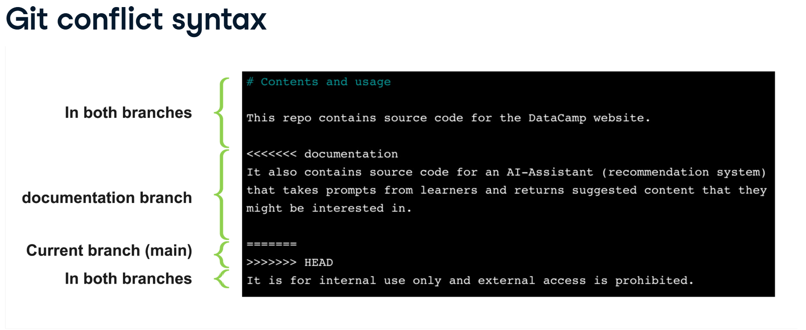
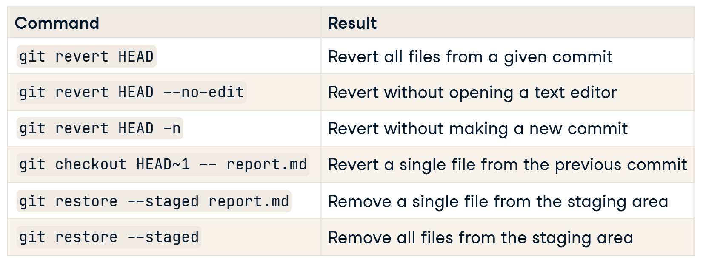

# Datacamp

## Introduction to Git

### What is version control?

Processes and systems to manage changes to files, progras, and directories.

It is useful for anything that changes over time(such as source code), or needs to be shared.

It can do:
    - Track files in different states
    - Combine different versions of files
    - Identify a particular version
    - Revert changes

Why use version control?
    - It is a safety net
    - It allows you to collaborate with others
    - It allows you to track changes to your code
    - Easily revert to previous safe version

### Introduction

- It is open source
- Free
- Stores everything in a local repository
- Can be used to share code with others using a remote repository
- Run on the shell

### Git workflow

1. Make changes to files in the working directory
2. Stage the files you want to commit
3. Commit the staged files to the local repository
4. Push the committed changes to a remote repository

### Git teminology

1. Git repo
    - Git repository: directory containing files and sub-directories with .git
    - Benefits: Track, Revert, Compare, Collaborate.
2. Git storage: .git directory
3. Nested repositories: avoid nesting git repositories, it can cause confusion and issues with tracking changes.
4. Staging: process of selecting which changes to include in the next commit.
5. Commit: snapshot of the changes made to the files in the staging area, along with a message describing the changes.
6. Remote repository: a version of the repository that is hosted on a server, allowing for collaboration and sharing of code with others.
7. Git hash: a 40-character unique identifier for each commit, generated using the SHA-1 algorithm, which allows you to track and reference specific commits in the repository history.
8. Git diff: a tool that shows the differences between two versions of a file, allowing you to see what changes were made between commits or between the working directory and the staging area.
9. HEAD: a reference to the current commit in the repository, which can be used to navigate through the commit history and make changes to the codebase. HEAD~1 refers to the commit before the current commit, HEAD~2 refers to the commit before that, and so on.
10. restore: a command that allows you to undo changes to files in the working directory or staging area, allowing you to revert to a previous version of the file or discard changes that have not yet been committed.
11. revert: a command that allows you to undo changes that have already been committed to the repository, creating a new commit that undoes the changes made in a previous commit.
12. reset: a command that allows you to undo changes to the commit history, allowing you to move the HEAD pointer to a previous commit and discard any commits that come after it in the history. This can be used to undo changes that have already been committed, but should be used with caution as it can permanently delete commits from the repository history.
13. checkout: a command that allows you to switch between different branches or commits in the repository, allowing you to view and work on different versions of the codebase. When you checkout a specific commit, you are in a "detached HEAD" state, which means that you are not on a branch and any changes you make will not be associated with a branch until you create a new branch or switch back to an existing branch.
14. Branches: an individual version of a repo, allowing to work on different features or version of the codebase without affecting the main branch. Branches can be merged back into the main branch when the changes are ready to be integrated. Default branch: main, other: feature/, bugfix/, hotfix/, release/, develop/, etc. With branches multiple developers can work on a project simultaneously, Compare the state of a repo between branches, Combine, pushing new features to a live system. Each branch have specific purpose. see 

    - Creating a new branch: **Branching off**
    - Creating a speed-test from main = **Branching off `main`**

15. Commit: a snapshot of the changes made to the files in the staging area, along with a message describing the changes. Each commit has a unique hash identifier, which allows you to track and reference specific commits in the repository history. Commits are used to create a record of the changes made to the codebase over time, allowing you to see how the code has evolved and to revert to previous versions if necessary.

    - parent commit: The last commits from each branch.
    - source - the branch we want to merge from
    - destination - the branch we want to merge into

16. Merge: the process of combining changes from one branch into another, allowing you to integrate new features or updates into the main branch when they are ready. When you merge a branch, Git will attempt to automatically combine the changes from both branches. If there are conflicts between the changes, Git will prompt you to resolve them manually before completing the merge.

    - Fast-forward merge: If the destination branch has not diverged from the source branch, Git will simply move the HEAD pointer of the destination branch to the latest commit of the source branch, effectively "fast-forwarding" the history of the destination branch to match that of the source branch.
    - Three-way merge: If the destination branch has diverged from the source branch, Git will create a new commit that combines the changes from both branches, using the common ancestor of the two branches as a reference point. This is known as a "three-way merge" because it involves three commits: the latest commit on the source branch, the latest commit on the destination branch, and their common ancestor.

17. Merge conflicts: If there are conflicting changes between the source and destination branches that cannot be automatically resolved by Git, it will mark the affected files as having merge conflicts and prompt you to manually resolve them. This typically involves editing the affected files to choose which changes to keep and which to discard, and then staging and committing the resolved files to complete the merge.

    - see 
    - avoid editing the same lines of code in different branches to minimize the chances of merge conflicts. Prvention is better than cure.

18. Remote repository: a version of the repository that is hosted on a server, allowing for collaboration and sharing of code with others. Remote repositories can be accessed and updated using Git commands, allowing multiple developers to work on the same codebase from different locations.
19. Local repository: a version of the repository that is stored on your local machine, allowing you to work on the codebase without needing an internet connection. Changes made in the local repository can be staged and committed, and then pushed to a remote repository when you are ready to share your changes with others.

### How git stores data`

1. Commit: contains the metadata, log message, commit time
2. Tree: track the names and locations of files and directories in the repo
3. Blob: Binay Large Object, a compressed snapshot of a file's contents

see: 

### Git commands

- `git --version` or `git -v`: Check the version of git installed
- `git init <directory_name>`: Initialize a new git repository
- `git init`: Initialize a new git repository in the current directory
- `git status`: Check status of the working directory and staging area
- `git add <file.name>`: Stage changes to be committed, Start tracking new files, Stage modified files, Stage deleted files
  - `git add .`: Stage all changes in the current directory and sub-directories
  - `git add -A` or `git add --all`!: Stage all changes in the entire repository
  - `git add -u` or `git add --update`!: Stage all modified and deleted files, but not new files
  - `git add -p` or `git add --patch`!: Interactively stage changes, allowing you to review and select specific changes to stage
  - `git add -i` or `git add --interactive`!: Interactively stage changes, allowing you to review and select specific changes to stage, with a menu-driven interface
  - `git add -n` or `git add --dry-run`!: Show which files would be staged without actually staging them
  - `git add -v` or `git add --verbose`!: Show which files are being staged as they are added
  - `git add -f` or `git add --force`!: Force staging of files that are otherwise ignored by .gitignore
- `git commit -m "message"`: Commit staged changes to the local repository
  - `git commit -a -m "message"`: Stage all modified and deleted files, and commit them in one step (does not stage new files)
  - -m: option allows you to include a commit message directly in the command, without opening a text editor. Be short and concise, but descriptive enough to understand the changes made in the commit.
- `git log`: View the commit history of the repository in reverse chronological order, showing the most recent commits first. Each commit will display its unique hash, author, date, and commit message. use space to scroll through the log, and `q` to exit the log view.
  - `git log -3`
  - `git log <file.name>`
  - `git log -2 <file.name>`
  - `git log --since='Month Day Year'`: Month(3-letter abbreviation), Day(1/2 digit), Year(4-digit)
  - `git log --until='Month Day Year'`: Month(3-letter abbreviation), Day(1/2 digit), Year(4-digit)
  - `git log --since='Month Day Year' --until='Month Day Year'`
  - `--since` and `--until` options can also accept relative date formats, such as "2 weeks ago", "3 months ago", or "1 year natural language like `2 weeks ago` or `3 months ago` or `yesterday`, Date formats like `07-15-2024`, or `2024-07-15` (recommended, ISO 8601 format), Month can also be 3-letter abbreviation or full name, Day can be 1 or 2 digits, Year can be 2 or 4 digits. Avoid (, /, .) in date formats to prevent confusion.
  - `git log --stat`!: Show a summary of changes for each commit, including the
  - `git log --oneline`!: View a condensed version of the commit history, showing only the commit hash and the first line of the commit message for each commit. This format is useful for quickly scanning through the commit history.
- `git show <commit_hash>`: View the details of a specific commit, including the changes made to files in that commit. Replace `<commit_hash>` with the unique hash identifier of the commit you want to view. only the first 7 characters of the hash are needed to uniquely identify a commit.
- `git diff`: Show the differences between the working directory and the staging area, or between two commits. By default, it shows the differences between the working directory and the staging area, allowing you to see what changes have been made but not yet staged. You can also specify two commits to compare, or a commit and the working directory. For example, `git diff <commit_hash>` will show the differences between the specified commit and the working directory, while `git diff <commit_hash1> <commit_hash2>` will show the differences between the two specified commits.
  - `git diff <file.name>`: Show the differences for a specific file
  - `git diff --staged` or `git diff --cached`: Show the differences between the staging area and the last commit, allowing you to see what changes are staged for the next commit.
  - `git diff --staged <file.name>` or `git diff --cached <file.name>`: Show the differences for a specific file between the staging area and the last commit
  - `git diff HEAD~1 HEAD`: Show the differences between the last commit and the one before it (HEAD~1 refers to the commit before the last commit) vs `git diff HEAD HEAD~1`: Show the differences between the last commit and the one before it (HEAD~1 refers to the commit before the last commit)
  - `git diff <commit_hash>`: Show the differences between the specified commit and the working directory
    - `git diff <commit_hash1> <commit_hash2>`: Show the differences between the two specified commits
    - `git diff <commit_hash> <file.name>`: Show the differences for a specific file between the specified commit and the working directory
    - `git diff <commit_hash1> <commit_hash2> <file.name>`: Show the differences for a specific file between the two specified commits
    - `git diff --name-only <commit_hash>`: Show only the names of the files that have changed between the specified commit and the working directory
    - `git diff --name-only <commit_hash1> <commit_hash2>`: Show only the names of the files that have changed between the two specified commits
    - `git diff --stat <commit_hash>`: Show a summary of changes for each file between the specified commit and the working directory
    - see summarty 
- `git revert <commit_hash>`: Create a new commit that undoes the changes made in the specified commit, effectively reverting the repository to the state it was in before that commit was made. This is a safe way to undo changes, as it does not alter the commit history and allows you to keep a record of the changes that were made and then undone.
  - --no-edit: option allows you to skip the commit message editor and use the default commit message generated by git, which includes the hash of the reverted commit and a brief description of the changes being reverted.
  - -n or --no-commit: option allows you to stage the changes for the revert without creating a new commit, allowing you to review and modify the changes before committing them.
- `git checkout <commit_hash>`: Switch to a specific commit, allowing you to view the state of the repository at that point in time. This is a way to explore the commit history and see how the code has evolved over time. However, it is important to note that when you checkout a specific commit, you are in a "detached HEAD" state, which means that you are not on a branch and any changes you make will not be associated with a branch until you create a new branch or switch back to an existing branch.
  - `git checkout HEAD -- report.md`: Discard changes to a specific file in the working directory, reverting it to the state it was in the last commit. This is a way to undo changes to a file that have not yet been staged or committed.
- `git restore <file.name>`: Discard changes to a specific file in the working directory, reverting it to the state it was in the last commit. This is a way to undo changes to a file that have not yet been staged or committed. It is similar to `git checkout HEAD -- <file.name>`, but `git restore` is a newer command that is more intuitive and easier to use for this purpose.
  - `git restore --staged <file.name>`: Unstage a specific file, removing it from the staging area but keeping the changes in the working directory. This is a way to undo the staging of a file without discarding the changes you have made to it.
  - `git restore`: Discard all changes in the working directory, reverting all files to the state they were in the last commit. This is a way to undo all changes that have not yet been staged or committed.
  - see 
- `git branch`: List all branches in the repository, with an asterisk (*) next to the currently active branch. This command allows you to see which branches are available in the repository and which one you are currently working on.
  - `git branch <branch_name>`: Create a new branch with the specified name. This allows you to create a separate line of development for a specific feature or version of the codebase without affecting the main branch.
  - `git branch -d <branch_name>`: Delete a branch that is no longer needed. This is a way to clean up branches that have been merged or are no longer relevant to the project.
  - `git branch -D <branch_name>`: Force delete a branch, even if it has unmerged changes. This should be used with caution, as it can result in the loss of work if the branch contains changes that have not been merged into another branch.
  - `git branch -m <old_branch_name> <new_branch_name>`: Rename an existing branch. This can be useful for improving the clarity and organization of your branches.
- `git switch <branch_name>`: Switch to a different branch, allowing you to work on a different version of the codebase. This command is used to change the active branch in your repository, allowing you to view and work on different versions of the codebase. When you switch branches, Git will update the files in your working directory to match the state of the branch you switched to.
  - `git switch -c <new_branch_name>`: Create a new branch and switch to it in one step. This is a convenient way to start working on a new feature or version of the codebase without having to run two separate commands.
- `git diff <branch_name>`: Show the differences between the current branch and the specified branch, allowing you to see what changes have been made in each branch. This is a way to compare the state of the codebase between two branches and identify any differences or conflicts that may need to be resolved before merging.
  - `git diff <branch_name> <file.name>`: Show the differences for a specific file between the current branch and the specified branch
  - `git diff <branch_name1> <branch_name2>`: Show the differences between two specified branches
- `git merge <source_branch>`: Merge the specified source branch into the current branch, combining the changes from both branches. This is a way to integrate changes from one branch into another, allowing you to bring new features or updates into the main branch when they are ready.
  - `git merge <source_branch> <source_branch>`: merger from another branch.
  - `git merge --no-ff <source_branch>`!: Perform a merge that creates a new commit even if the merge could be resolved with a fast-forward. This is useful for preserving the history of the source branch and making it clear that a merge occurred.
- `git push`: Push committed changes to a remote repository

## Intermediate Git

### Introduction to branches

## Questions

- General format of version definining.
- What is shell. (learn/bash)
- branch?
- read git diff output
- practice revert, reset, restore, checkout
- remote repository: GitHub, GitLab, Bitbucket
- rebase, bisecting, submodules, conflicts, stash, tags, hooks, gitignore
- merge, pull request, fork, clone, fetch, pull
- What if I edited main branch by mistake? and I want to move those changes to a new branch?
- How to undo a commit that has already been pushed to a remote repository?
- Types of merge?
- PR, issue, tickets?
