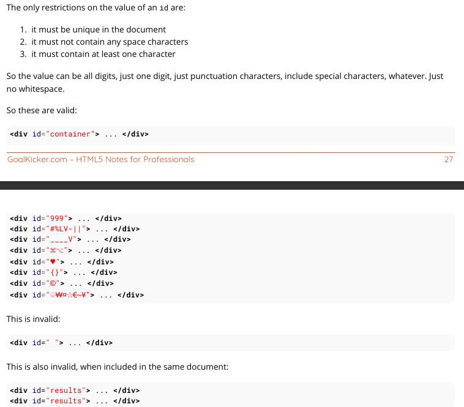
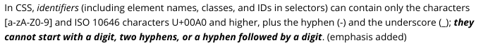
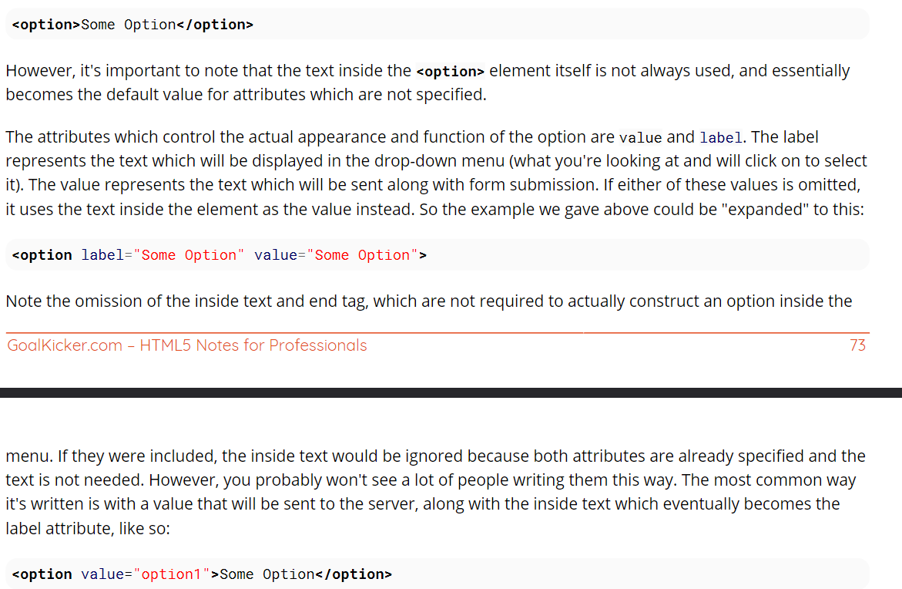
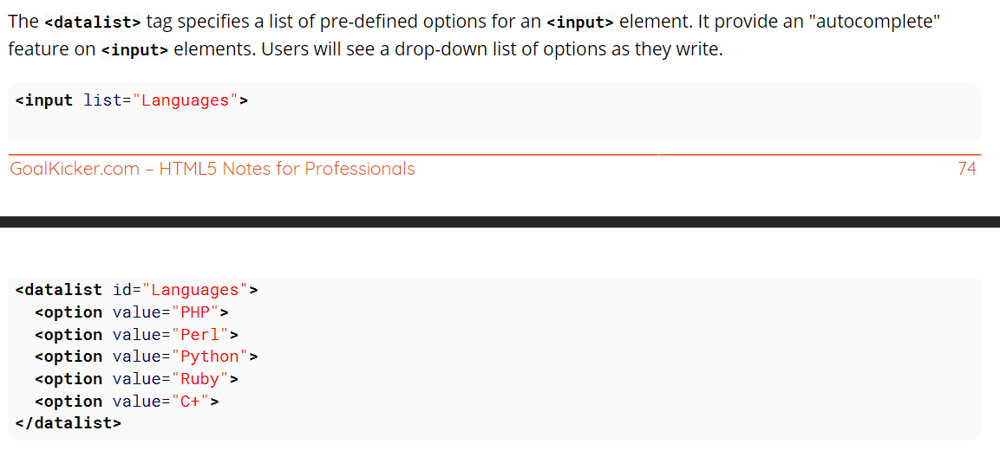

# QUESTIONS

- void or self closing?
- `` OR ``
- elements vs tag?
- ISO language codes list?
- SGML, DTD?
- global attributes?
- specific attributes?
- absolute vs relative path?
- language value BCP 47? for hreflang? a?
- defined relation specification? in rel? a?
- a - target="_self/_parent/_top/framename(deprecated)"?
- title attribute?
- a - download ?
- cc? bcc? in mailto:?
- `<link rel="stylesheet" href="print.css" media="print">`?
- thead? tbody? tfoot? colgroup? rowspan? colspan = "0"?
- table? need high revesion...? **MUST**
- markup? vs markdown?
- selector
- setAttribute? getAttribute?
- _ - data-*? dataset?
- crossorigin?
- linking resources? charset, crossorigin, href, hreflang, media, rel, rev, sizes, target, sizes(only when rel="icon"), type, integrity? enumrated values?
- script normal vs async vs defer?
- `<style> @import("path/to.css") </style>` ?
- mime-type? image/png *.png vs image/x-icon *.ico
- alternate css?
- Resource Hint: link - rel="preconnect|dns-prefetch|prefetch|prerender"?
- tcp handshake? dns resolve? tls negotiation?
- mediatype?
- web feed? atom/rss?
- srcset? sizes?
- form - enctype ?
- default css? block? inline-block? inline?
- form revise must?
- styling progress bar/
- styling wierd form and other elements?
- datalist, styling, search local suggestion?
- embed? myflash.swf?
- audio vs video vs embed vs iframe?
- boolean attribute?
- [defense in depth](https://en.wikipedia.org/wiki/Defense_in_depth_%28computing%29)?
- applet, base, basefont, br, frame, frameset, hr, iframe, meta, param, script no lang="?" ?




# NOTE

- must not use style elements(font, center) use css
- Markup means that with HTML you declare what is presented to a viewer, not how it is presented
- Doctype declarations are not HTML tags.
- heading for level not for style - Search engines and other user agents usually index page content based on heading elements, for example to create a table of contents, so using the correct structure for headings is important.
- extra spaces will be removed by browser
-  What’s the difference? Semantics. `<strong>` is used to indicate that the text is fundamentally or semanticallyimportant to the surrounding text, while `<b>` indicates no such importance and simply represents text that should be bolded. If you were to use `<b>` a text-to-speech program would not say the word(s) any differently than any of the other words around it - you are simply drawing attention to them without adding any additional importance. By using `<strong>`, though, the same program would want to speak those word(s) with a different tone of voice to convey that the text is important in some way. 
- For example, if you wanted to stress the action inside a sentence, one might do so by emphasizing it in italics via `<em>`: "Would you just submit the edit already?" But if you were identifying a book or newspaper that you would normally italicize stylistically, you would simply use `<i>`: "I was forced to read Romeo and Juliet in high school.
- `<u>` element itself was deprecated in HTMl 4, it was reintroduced with alternate semantic meaning in HTML 5 - to represent an unarticulated, non-textual annotation. You might use such a rendering to indicate misspelled text on the page, or for a Chinese proper name mark.
- a href - Specifies the destination address. It can be an absolute or relative URL, or the name of an anchor. An absolute URL is the complete URL of a website like http://example.com/. A relative URL points to another directory and/or document inside the same website, e.g.  /about-us/ points to the directory “about-us” inside the root directory (/). When pointing to another directory without explicitly specifying the document, web servers typically return the document “index.html” inside that directory.
- a - target - should not be used extensivly
- `<a href="ftp://example.com/">This could be a link to a FTP site</a>` - In this case, the difference is that this anchor tag is requesting that the user's browser connect to example.com using the File Transfer Protocol (FTP) rather than the Hypertext Transfer Protocol (HTTP).
- Remember, you can always `<a href="page1.html#Topic1">look back in the First Topic</a>` for supporting information.
- a - link to external site absolute path, link on id with #id, link on same server relative path,link on another page id page.html#id, tel:, mailto:, javascript
- `<a href="javascript:myFunction();">Run Code</a>` same as
- `<a href="#" onclick="myFunction(); return false;">Run Code</a>`
- The return false; is necessary to prevent your page from scrolling to the top when the link to # is clicked. Make sure to include all code you'd like to run before it, as returning will stop execution of further code.
- Also noteworthy, you can include an exclamation mark ! after the hashtag in order to prevent the page fromscrolling to the top. This works because any invalid slug will cause the link to not scroll anywhere on the page, because it couldn't locate the element it references (an element with id= "!"). You could also just use any invalid slug (such as #scrollsNowhere) to achieve the same effect. In this case, return false; is not required:` <a href="#!" onclick="myFunction();">Run Code</a>`
-  The answer is almost certainly no. Running JavaScript inline with the element like this is fairly bad practice. Consider using pure JavaScript solutions that look for the element in the page and bind a function to it instead. Listening for an event
- a - target="_blank/_self/_parent/_top/framename(deprecated)"
- SECURITY VULNERABILITY WARNING! Using target="_blank" gives the opening site partial access to the window.opener object via JavaScript, which allows that page to then access and change the window.opener.location of your page and potentially redirect users to malware or phishing sites. Whenever using this for pages you do not control, add `rel="noopener"` to your link to prevent the window.opener object from being sent with the request. Currently, Firefox does not support noopener, so you will need to use `rel="noopener noreferrer"` maximum effect.
- ol - type="1|a|A|i|I"
- The nested list has to be a child of the li element
-  When printing out a table that doesn't fit onto one (paper) page, most browsers repeat the contents of `<thead>` on every page.
- `<colgroup>` elements must be child elements of a `<table>` and must come after any `<caption>` elements and before any table content (e.g., `<tbody>`, etc.).
- colgroup styles - border, backgroud, width, visibility, display
- th - scope="col|row|colgroup|rowgroup"
- `<h1 <!-- testAttribute="something" -->>This will not work</h1>`
-  For compatibility with tools that try to parse HTML as XML or SGML, the body of your comment should not contain two dashes `--`
- we can Commenting out whitespace between inline elements
```html
<!-- Use an HTML comment to nullify the newline character below: -->
    <a href="#">I hope there will be no extra whitespace after this!<a><!--
    --><button>Foo</button>
```
-  IDs are generally used with JavaScript and internal document links, and are discouraged in CSS
- `<link rel="stylesheet" href="path/to.css">`
- `<link rel="icon" type="image/png" href="/favicon.png">`
- `<link rel="shortcut icon" type="image/x-icon" href="/favicon.ico">`
- file named favicon.ico at the root of your website will typically be loaded and applied automatically, without the need for a `<link>`
- `<link rel="alternate stylesheet" href="path/to/style.css" title="yourTitle">`
- link - rel="stylesheet alternative preconnect dns-prefetch prefetch prerender icon shortcut import"
- img - src="data:image/png;base64,iVOR..."
- sizes and srcset
```html

```
- There is a semantic difference between including an empty alt attribute and excluding it altogether. An empty alt attribute indicates that the image is not a key part of the content (as is true in this case - it's just an additive image that is not necessary to understand the rest) and thus may be omitted from rendering. However, the lack of an alt attribute indicates that the image is a key part of the content and that there simply is no textual equivalent available for rendering.
- picture
```html
<picture>
    <source media="(min-width: 600px)" srcset="large_image.jpg">
    <source media="(min-width: 450px)" srcset="small_image.jpg">
    
</picture>
```

- `<form action="action.php" method="post" target="_blank" accept-charset="UTF-8"enctype="application/x-www-form-urlencoded" autocomplete="off" novalidate>`
- The <article> element contains self-contained content like articles, blog posts, user comments or an interactive widget that could be distributed outside the context of the page, for example by RSS
- sample 

```html
<section>
    <!-- Each individual blog post is an <article> -->
    <article>
        <header>
            <h1>Blog Post</h1>
            <time datetime="2016-03-13">13th March 2016</time>
        </header>
        <p>The article element represents a self contained article or document.</p>
        <p>The section element represents a grouping of content.</p>
        <section>
            <h2>Comments <small>relating to "Blog Post"</small></h2>
            <!-- Related comment is also a self-contained article -->
            <article id="user-comment-1">
                <p>Excellent!</p>
                <footer><p>...</p><time>...</time></footer>
            </article>
        </section>
    </article>
    <!-- ./repeat: <article> -->
 </section>
 <!-- Content unrelated to the blog or posts should be outside the section. -->
 <footer>
    <p>This content should be unrelated to the blog.</p>
 </footer>
```
- replace the article with a <main> element to indicate this is the main content for this page
- The <main> element should only ever be used at most once on a single page.
- The <main> element must not be included as a descendant of an article, aside, footer, header or nav element.
```html
 <body>
    <header>
        <nav>...</nav>
    </header>
    <main>
        <h1>Individual Blog Post</h1>
        <p>An introduction for the post.</p>
        <article>
            <h2>References</h2>
            <p>...</p>
        </article>
        <article>
<h2>Comments</h2> ...
 </article>
 </main>
 <footer>...</footer>
 </body>
```
```html
<audio controls>
 <source src="file.mp3" type="audio/mpeg">
 Your browser does not support the audio element.
 </audio>
```

```html
<!-- Simple video example -->
 <video src="videofile.webm" autoplay poster="posterimage.jpg">
  Sorry, your browser doesn't support embedded videos,
  but don't worry, you can <a href="videofile.webm">download it</a>
  and watch it with your favorite video player!
 </video>
 <!-- Video with subtitles -->
 <video src="foo.webm">
 <track kind="subtitles" src="foo.en.vtt" srclang="en" label="English">
 <track kind="subtitles" src="foo.sv.vtt" srclang="sv" label="Svenska">
 </video>
 <!-- Simple video example -->
 <video width="480" controls poster="https://archive.org/download/WebmVp8Vorbis/webmvp8.gif" >
  <source src="https://archive.org/download/WebmVp8Vorbis/webmvp8.webm" type="video/webm">
  <source src="https://archive.org/download/WebmVp8Vorbis/webmvp8_512kb.mp4" type="video/mp4">
  <source src="https://archive.org/download/WebmVp8Vorbis/webmvp8.ogv" type="video/ogg">
  Your browser doesn't support HTML5 video tag.
 </video>

 <!-- Simple audio playback -->
 <audio src="http://developer.mozilla.org/@api/deki/files/2926/=AudioTest_(1).ogg" autoplay>
  Your browser does not support the <code>audio</code> element.
 </audio>
 <!-- Audio playback with captions -->
 <audio src="foo.ogg">
  <track kind="captions" src="foo.en.vtt" srclang="en" label="English">
  <track kind="captions" src="foo.sv.vtt" srclang="sv" label="Svenska">
 </audio>

  <video width="1280" height="720" autoplay muted loop poster="video.jpg" id="videobg">
  <source src="video.mp4" type="video/mp4">
  <source src="video.webm" type="video/webm">
  <source src="video.ogg" type="video/ogg">
 </video>
 <style>
 #videobg {
  background: url(video.jpg) no-repeat;
  background-size: cover;
 }
 </style>
```

- Browsers that support the progress tag will ignore the div nested inside. Legacy browsers which cannot identify the progress tag will render the div instead.

```html
<progress max="100" value="20">
    <div class="progress-bar">
        <span style="width: 20%;">Progress: 20%</span>
    </div>
</progress>
```

## DATALIST


## anchor with iframe

```html
<iframe src="webpage.html" name="myIframe"></iframe>
<a href="different_webpage.html" target="myIframe">Change the Iframe content to different_webpage.html</a>
```


# TAG LIST

- img src srcset sizes crossorigin usemap ismap alt width height
- meta
- input
- video
- audio
- table
- footer
- html
- body
- h1 - h6
- p
- br
- hr
- pre
- mark
- strong
- b
- em
- i
- u
- abbr title=""
- ins
- del
- s
- sub
- sup
- a href, hreflang, rel, target, title, download
- ol start, reversed, type
- li value
- ul
- dl
- dt
- dd
- table
- tr 
- th scope
- td colspan, rowspan
- thead
- tbody
- tfoot
- colgroup span
- col
- caption
- `<!-- -- >` - comment
- _ class, id, data-*, title, dataset?
- link rel media href hreflang charset crossorigin="anonymous" rev sizes target type integrity
- script src type async defer charset crossorigin nonce
- noscript
- picture
- source media
- input
- div
- span
- nav role="navigation"
- article
- section role="main"
- main
- header
- footer
- aside
- output
- area
- base
- col (deprecated)
- hr
- param
- command (obsolete)
- code
- keygen (deprecated)
- source
- audio controls width height track autoplay loop muted poster
- video
- progress max value position label
- select name size multiple
- option value selected disabled
- optgroup disabled
- embed type src width height
- iframe name width height src srcdoc sandbox="allow-scripts|allow-forms|allow-same-origin|allow-top-navigation" allowfullscreen
- 


