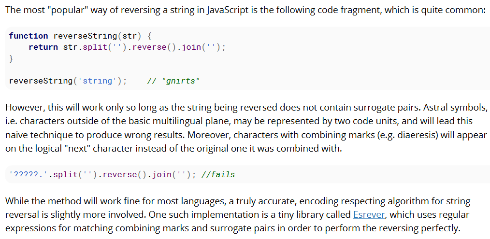
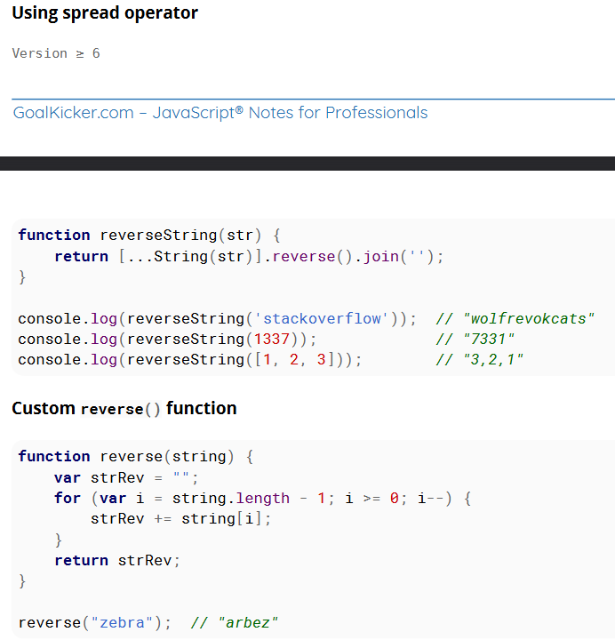
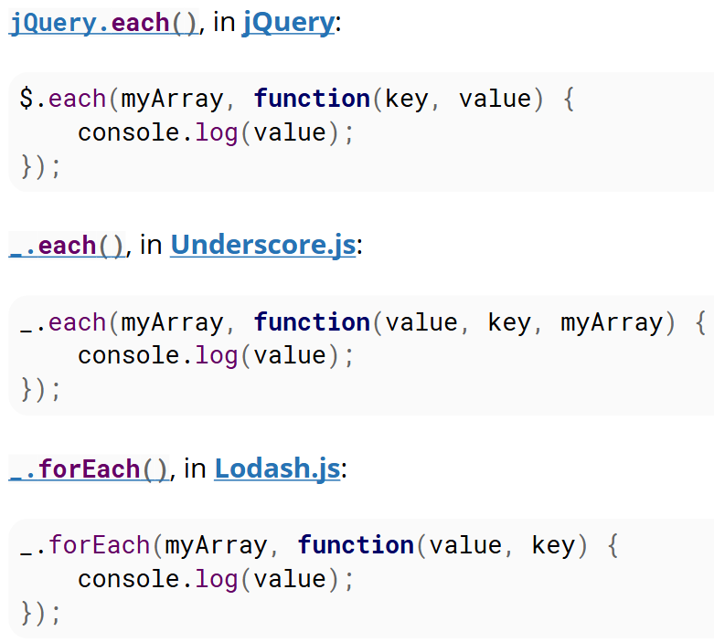
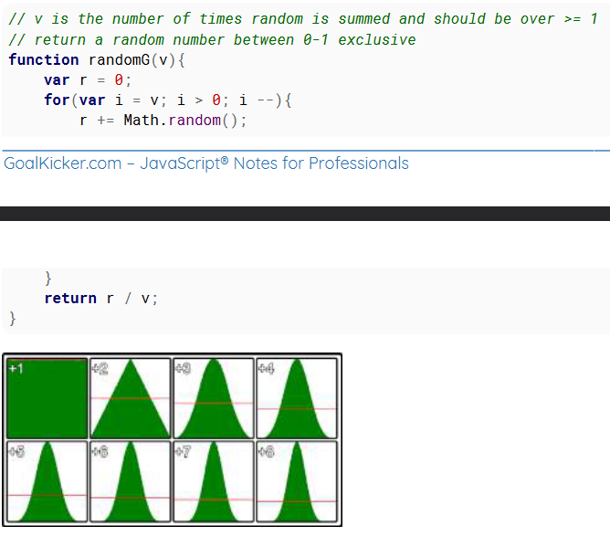

<!-- Questions --

- DOM ? document ? window ?
- alert ? prompt ? confirm ?
- modal window ?
- Number ?
- NaN vs null vs undefined ?
- practice type conversion in js ?
- window.hasOwnProperty() ?
- whenever NaN is returned ?
- advanced vscode comments for better code ?
- in node `.___` REPL keywords ?
- debug? info? timeStamp ?
- new Date() ? Error() ? Image() ? RegExp() ?
- valueOf() ?
- String() ? Number() ? Object() ? Array() ? Set() ? Map() ?
- Object.is() ?
- practice bitfield for keyword moves and other ?
- practice array methods ?
- String.raw ?

```js
`a\\b` // =  a\b
String.raw`a\\b` // = a\\b
```

- string literals ?
- spread operator ? rest operator ?
- practice string ? must ?
- codePointAt() ?
- practice date in js ?
- practice array ?
- prototype ?
- jQuery ? underscore ? lodash ?
- destructuring ?
- deep functions like deep reverse, deep compare, deep clone etc
- apply(), bind(), call() ?
- object in js ?
- default parameter ?
- overloading ?
- strict mode ?
- anArray instanceof Array vs Array.isArray(anArray) ?
- __proto__ ?
- binary ? octal ? decimal ? hexadecimal ? 32 base ?
- Big vs Little Endian ?

```js
var isLittleEndian = true;
(()=>{
    var buf = new ArrayBuffer(4);
    var buf8 = new Uint8ClampedArray(buf);
    var data = new Uint32Array(buf);
    data[0] = 0x0F000000;
    if(buf8[0] === 0x0f){
        isLittleEndian = false;
    }
})();
```

- Typed arrays ?
- 1's component ? 2's component ?
- constructor function ?
- Function declaration effectively creates variables, as well ?
- async loop ?
- Types of errors: ReferenceError, TypeError, SyntaxError
- decorators ?
- yield ? generator function syntax ?
- closure?
- object defining shortcut? no key? `{ data: this.data, text }`
- Symbols
- Datatypes and Data structures in js
- what is context?
- built in readymade objects like naigator, set, map, history, localstorage, etc?
- what is the uses of cookies and how to properly use them?

-->

# notes

## Version and Release Date

```console
1   - 1997-06-01
2   - 1998-06-01
3   - 1998-12-01
E4X - 2004-06-01
5   - 2009-12-01
5.1 - 2011-06-01
6   - 2015-06-01
7   - 2016-06-14
8   - 2017-06-27
```

## window.isNaN()

```js
isNaN(NaN);          // true
isNaN(1);            // false: 1 is a number
isNaN(-2e-4);        // false: -2e-4 is a number (-0.0002) in scientific notation
isNaN(Infinity);     // false: Infinity is a number
isNaN(true);         // false: converted to 1, which is a number
isNaN(false);        // false: converted to 0, which is a number
isNaN(null);         // false: converted to 0, which is a number
isNaN("");           // false: converted to 0, which is a number
isNaN(" ");          // false: converted to 0, which is a number
isNaN("45.3");       // false: string representing a number, converted to 45.3
isNaN("1.2e3");      // false: string representing a number, converted to 1.2e3
isNaN("Infinity");   // false: string representing a number, converted to Infinity
isNaN(new Date);     // false: Date object, converted to milliseconds since epoch
isNaN("10$");        // true : conversion fails, the dollar sign is not a digit
isNaN("hello");      // true : conversion fails, no digits at all
isNaN(undefined);    // true : converted to NaN
isNaN();             // true : converted to NaN (implicitly undefined)
isNaN(function(){}); // true : conversion fails
isNaN({});           // true : conversion fails
isNaN([1, 2]);       // true : converted to "1, 2", which can't be converted to a number
isNaN([]);           // false
isNaN([34]);         // false
```

## Number.isNaN()

```js
// The one and only
Number.isNaN(NaN);          // true
// Numbers
Number.isNaN(1);            // false
Number.isNaN(-2e-4);        // false
Number.isNaN(Infinity);     // false
// Values not of type number
Number.isNaN(true);         // false
Number.isNaN(false);        // false
Number.isNaN(null);         // false
Number.isNaN("");           // false
Number.isNaN(" ");          // false
Number.isNaN("45.3");       // false
Number.isNaN("1.2e3");      // false
Number.isNaN("Infinity");   // false
Number.isNaN(new Date);     // false
Number.isNaN("10$");        // false
Number.isNaN("hello");      // false
Number.isNaN(undefined);    // false
Number.isNaN();             // false
Number.isNaN(function(){}); // false
Number.isNaN({});           // false
Number.isNaN([]);           // false
Number.isNaN([1]);          // false
Number.isNaN([1, 2]);       // false
Number.isNaN([true]);       // false
```

## Infinity

```js
Infinity > 123192310293; // true
-Infinity < -123192310293; // true
1 / 0; // Infinity
Math.pow(123123123, 9123192391023); // Infinity
Number.MAX_VALUE * 2; // Infinity
23 / Infinity; // 0
-Infinity; // -Infinity
-Infinity === Number.NEGATIVE_INFINITY; // true
-0; // -0 , yes there is a negative 0 in the language
0 === -0; // true
1 / -0; // -Infinity
1 / 0 === 1 / -0; // false
Infinity + Infinity; // Infinity
var a = 0, b = -0;
a === b; // true
1 / a === 1 / b; // false
```

## Math constant

```js
Number.MAX_VALUE;          // 1.7976931348623157e+308
Number.MAX_SAFE_INTEGER;   // 9007199254740991
Number.MIN_VALUE;          // 5e-324
Number.MIN_SAFE_INTEGER;   // -9007199254740991
Number.EPSILON;            // 0.0000000000000002220446049250313
Number.POSITIVE_INFINITY;  // Infinity
Number.NEGATIVE_INFINITY;  // -Infinity
Number.NaN;                // NaN
```

## proper isNumber

```js
function isNumber(value) {
    //null.constructor and undefined.constructor throw an error when accessed
    if (value === null || value === undefined) return false
    return value.constructor === Number
}
console.log(isNumber(null), isNumber(undefined))                  //false false
console.log(isNumber('abc'), isNumber([]), isNumber(() => 1))     //false false false
console.log(isNumber(0), isNumber(Number('10.1')), isNumber(NaN)) //true true true
```

## String

- String are immutale

- Enclosed in
  - single quote
  - double quote
  - backticks
- Creation
  - using literal - `"a string"`
  - using templaye - `hello &{variable}`
  - using String.raw - `String.raw'a\\b'` - to have unmodified string
  - using String() - `String(32); // "32", String(true); // "true", String(null); // "null"`
  - using _.toString() - `(5232).toString(); // "5232", (false).toString(); // "false", ({}).toString(); // "[object Object]"`
  - using fromCharCode() - `String.fromCharCode(104,101,108,108,111) //"hello"`
  - using new String("asdf") - not recommended as typesof this is 'object'
- Concatination
  - using +operator
  - other types are converted to string - 12 + "asdf" + true = 12asdftrue
- Lexographical Comparison _.localeCompare()
  - returns -ve if first is less
  - returns +ve if first is great
  - return 0 if both are same
- Access index
  - "Hello, World!".charAt(4) = "o"
  - "HEllo, World!"[4] = "o"
  - "Hello, World!".charCodeAt(4) = 111
- string a unicode by default
- Split and join: "a, b, c, d".split(", ").join("--") // a--b--c--d
- JavaScript has native conversion from Number to its String representation for any base from 2 to 36

### String reverse




### Word count

```js
function wordCount( val ){
    var wom = val.match(/\S+/g);
    return {
        charactersNoSpaces : val.replace(/\s+/g, '').length,
        characters         : val.length,
        words              : wom ? wom.length : 0,
        lines              : val.split(/\r*\n/).length
    };
}
```

### is this String

```js
var isString = function(value) {
    return typeof value === "string" || value instanceof String;
};
```

or check functionality instead of type

```js
if(aString.substring === String.prototype.substring) {
    aString.substring(0, );
}
```

### String methods

- .trim(), .trimStart(), .trimEnd()
- .substring()
- .slice()
- indexOf() lastIndexOf() replace() includes() toUpperCase() toLowerCase() repeat()

### Number to String

```js
// base 10 Number
var b10 = 12;
// base 16 String representation
var b16 = b10.toString(16); // "c"
```

### String to Number

```js
let b16 = '3.243f3e0370cdc';
// Split into integer and fraction parts
let [i16, f16] = b16.split('.');
// Calculate base 10 integer part
let i10 = parseInt(i16, 16); // 3
// Calculate the base 10 fraction part
let f10 = parseInt(f16, 16) / Math.pow(16, f16.length); // 0.14158999999999988
// Put the base 10 parts together to find the Number
let b10 = i10 + f10; // 3.14159
```

### Replacing string match with a callback function

"string".replace() can have a function as its second argument so you can provide a replacement based on some logic.

```js
"Some string Some".replace(/Some/g, (match, startIndex, wholeString) => {
  if(startIndex == 0){
    return 'Start';
  } else {
    return 'End';
  }
});
// will return Start string End
```

One line template library

```js
let data = {name: 'John', surname: 'Doe'}
"My name is {surname}, {name} {surname}".replace(/(?:{(.+?)})/g, x => data[x.slice(1,-1)]);
// "My name is Doe, John Doe"
```

## Working with Date and Time [ incomeplete ] 39

- Date.prototype.toISOString() ?

### Creation

1. Default using Date() - give date instance till current day up to milliseconds
2. with a integer(millisecond) - Date(m) creates a Date instance containing the time and date corresponding to the Epoch time (1 January, 1970 UTC) plus m milliseconds. Example: new Date(749019369738) gives the date Sun, 26 Sep 1993 04:56:09 GMT
3. with String - Date(dateString) returns the Date object that results after parsing dateString with Date.parse.
4. with multiple argue - Date(i1, i2, i3, i4, i5, i6) reads the arguments as year, month, day, hours, minutes, seconds, milliseconds and instantiates the corresponding Dateobject. Note that the month is 0-indexed in JavaScript, so 0 means January and 11 means December. Example: new Date(2017, 5, 1) gives June 1st, 2017
 
- ??????????????????????????????????????????? read chapter 8 and 9

## Comparison and type conversion

- ???????????? practice read chapter 10.10

### short circuting

- envVariable || configValue || defaultConstValue // select the first "truthy" of these

```js
var nullableObj = null;
var obj = nullableObj || {};  // this selects {}
var nullableObj2 = {x: 5};
var obj2 = nullableObj2 || {} // this selects {x: 5}
```

### Object.is()

```js
Object.is(1, 1);            // true
Object.is(+0, -0);          // false
Object.is(NaN, NaN);        // true
Object.is(true, "true");    // false
Object.is(false, 0);        // false
Object.is(null, undefined); // false
Object.is(1, "1");          // false
Object.is([], []);          // false
```

This algorithm has the properties of an equivalence relation:
    - Reflexivity: Object.is(x, x) is true, for any value x
    - Symmetry: Object.is(x, y) is true if, and only if, Object.is(y, x) is true, for any values x and y.
    - Transitivity: If Object.is(x, y) and Object.is(y, z) are true, then Object.is(x, z) is also true, for any values x, y and z

### example

```js
var isLegal = age >= 18;
var tall = height >= 5.11;
var suitable = isLegal && tall;
var isRoyalty = status === 'royalty';
var specialCase = isRoyalty && hasInvitation;
var canEnterOurBar = suitable || specialCase;
if (canEnterOurBar) console.log('You can enter our club');
```

### Bit Field

```js
var bitField = 0;  // the value to hold the bits
const KEY_BITS = [4,1,8,2]; // left up right down
const KEY_MASKS = [0b1011,0b1110,0b0111,0b1101]; // left up right down
window.onkeydown = window.onkeyup = function (e) {
    if(e.keyCode >= 37 && e.keyCode <41){
GoalKicker.com – JavaScript® Notes for Professionals 73
        if(e.type === "keydown"){
            bitField |= KEY_BITS[e.keyCode - 37];
        }else{
            bitField &= KEY_MASKS[e.keyCode - 37];
        }
    }    
}
```

```js
var directionState = [false,false,false,false];
window.onkeydown = window.onkeyup = function (e) {
    if(e.keyCode >= 37 && e.keyCode <41){
        directionState[e.keyCode - 37] = e.type === "keydown";
    }    
}
```

```js
// as bit field
if(!bitfield) // no keys are on
// as array test each item in array
if(!(directionState[0] && directionState[1] && directionState[2] && directionState[3])){

// postfix U,D,L,R for Up down left right
const KEY_U = 1;
const KEY_D = 2;
const KEY_L = 4;
const KEY_R = 8;
const KEY_UL = KEY_U + KEY_L; // up left
const KEY_UR = KEY_U + KEY_R; // up Right
const KEY_DL = KEY_D + KEY_L; // down left
const KEY_DR = KEY_D + KEY_R; // down right
if ((bitfield & KEY_UL) === KEY_UL) // is UP and LEFT only down
if (bitfield  & KEY_UL)             // is Up left down
if ((bitfield & KEY_U) === KEY_U)   // is Up only down
if (bitfield & KEY_U)               // is Up down (any other key may be down)
if (!(bitfield & KEY_U))            // is Up up (any other key may be down)
if (!bitfield )                     // no keys are down
if (bitfield )                      // any one or more keys are down
```

## Conditions

```js
// ternary operator with (, )
var a = 0;
var str = 'not a';
var b = '';
b = a === 0 ? (a = 1, str += ' test') : (a = 2);
```

### Strategy pattern to replace switch case

```js
const AnimalSays = {
    dog () {
        return 'woof';
    },
    cat () {
        return 'meow';
    },
    lion () {
        return 'roar';
    },
    // ... other animals
    default () {
        return 'moo';
    }
};
// The above object can be used as follows:
function makeAnimalSpeak (animal) {
    // Match the animal by type
    const speak = AnimalSays[animal] || AnimalSays.default;
    console.log(animal + ' says ' + speak());
}
// Results:
makeAnimalSpeak('dog') // => 'dog says woof'
makeAnimalSpeak('cat') // => 'cat says meow'
makeAnimalSpeak('lion') // => 'lion says roar'
makeAnimalSpeak('snake') // => 'snake says moo'
```

## Arrays

### Array Creation

1. using array literal - [1, 2, 3, 4]
2. using new Array()
  - new Array() - []
  - new Array(3) - [undefined, undefined, undefined]
  - new Array(1, 2, 3) - [1, 2, 3]
  - new Array("foo") - ["foo"]
3. using Array.of()
  - same as new Array()
  - Array.of(34) - [34]
4. using Array.from
  - can map through while creation
  - Array.from({ length: 5}, (_, index) => Math.pow(index, 2)) - [0, 1, 4, 9, 16]

### Array-like

- JavaScript has "Array-like Objects", which are Object representations of Arrays with a length property

```js
var realArray = ['a', 'b', 'c'];
var arrayLike = {
  0: 'a',
  1: 'b',
  2: 'c',
  length: 3
};
```

- examples - the arguments object in functions and HTMLCollection or NodeList objects returned from methods like document.getElementsByTagName or document.querySelectorAll.

```js
var parent = document.getElementById('myDropdown');
var desiredOption = parent.querySelector('option[value="desired"]');
var domList = parent.children;
domList.indexOf(desiredOption); // Error! indexOf is not defined.
domList.forEach(function() {
  arguments.map(/* Stuff here */) // Error! map is not defined.
}); // Error! forEach is not defined.
function func() {
  console.log(arguments);
}
func(1, 2, 3);   // → [1, 2, 3]
```

- difference - Array-like objects inherit from Object.prototype instead of Array.prototype. This means that Array-like Objects can't access common Array prototype methods like forEach(), push(), map(), filter(), and slice()

- Convert Array-like Objects to Arrays in ES6

1. Array.from()

```js
const arrayLike = {
  0: 'Value 0',
  1: 'Value 1',
  length: 2
};
arrayLike.forEach(value => {/* Do something */}); // Errors
const realArray = Array.from(arrayLike);
realArray.forEach(value => {/* Do something */}); // Works
```

2. for...of

```js
var realArray = [];
for(const element of arrayLike) {
  realArray.append(element);
}
```

3. Spread operator

```js
[...arrayLike]
```

4. Object.values

```js
var realArray = Object.values(arrayLike);
```

5. Object.keys

```js
var realArray = Object
   .keys(arrayLike)
   .map((key) => arrayLike[key]);
```

6. Array.prototype.slice.call()

```js
var arrayLike = {
  0: 'Value 0',
  1: 'Value 1',
  length: 2
};
var realArray = Array.prototype.slice.call(arrayLike);
realArray = [].slice.call(arrayLike); // Shorter version
realArray.indexOf('Value 1'); // Wow! this works
```

7. forEach on dom

```js
var domList = document.querySelectorAll('#myDropdown option');
domList.forEach(function() {
  // Do stuff
}); // Error! forEach is not defined.
Array.prototype.forEach.call(domList, function() {
  // Do stuff
}); // Wow! this works
```

8. bind

```js
var arrayLike = {
  0: 'Value 0',
  1: 'Value 1',
  length: 2
};
arrayLike.forEach(function() {
  // Do stuff
}); // Error! forEach is not defined.
[].forEach.bind(arrayLike)(function(val){
  // Do stuff with val
}); // Wow! this works
```

9. Array.from

```js
Array.from(domList, element => element.tagName); // Creates an array of tagName's
```

### Array methods

1. reduce

```js
[1, 2, 3, 4].reduce((acc, curr) => acc + curr , 1); // 11
```

```js
// Fallten array of objects
var array = [{
    key: 'one',
    value: 1
}, {
    key: 'two',
    value: 2
}, {
    key: 'three',
    value: 3
}];
// Version ≤ 5.1
array.reduce(function(obj, current) {
  obj[current.key] = current.value;
  return obj;
}, {});
// Version ≥ 6
array.reduce((obj, current) => Object.assign(obj, {
  [current.key]: current.value
}), {});
// Version ≥ 7
array.reduce((obj, current) => ({...obj, [current.key]: current.value}), {});
```

```js
// keep track of an array element as well. find the min value:
[4, 2, 1, -10, 9].reduce((a, b) => a < b ? a : b, Infinity);
// → -10
```

```js
// merge two arrays as key value pairs
var columns = ["Date", "Number", "Size", "Location", "Age"];
var rows = ["2001", "5", "Big", "Sydney", "25"];
var result =  rows.reduce(function(result, field, index) {
  result[columns[index]] = field;
  return result;
}, {})
console.log(result);
Output:
{
  Date: "2001",
  Number: "5",
  Size: "Big",
  Location: "Sydney",
  Age: "25"
}
```

2. map

```js
['one', 'two'].map(function(value, index, arr) {
  console.log(this); // Object { documentation: "randomObject" }
  return value.length;
}, {
  documentation: 'randomObject'
});
```

3. filter

```js
var uniqueArray = ['a', 1, 'a', 2, '1', 1].filter(function(value, index, self) {
  return self.indexOf(value) === index;
}); // returns ['a', 1, 2, '1']
```

```js
// Filter falsy values
[ 0, undefined, {}, null, '', true, 5].filter(Boolean);
```

```js
function startsWithLetterA(str) {
    if(str && str[0].toLowerCase() == 'a') {
        return true
    }
    return false;
}
var str              = 'Since Boolean is a native javascript function/constructor that takes [one optional parameter] and the filter method also takes a function and passes it the current array item as a parameter, you could read it like the following';
var strArray         = str.split(" ");
var wordsStartsWithA = strArray.filter(startsWithLetterA);
//["a", "and", "also", "a", "and", "array", "as"]
```

4. sort

- why b - a ?

```js
['s', 't', 'a', 'c', 'K', 1, 'v', 'E', 'r', 'f', 'l', 'o', 'W'].sort((a, b) => {
  return a.toString().localeCompare(b);     
});
```

```js
// String sorting by length (longest first)
["zebras", "dogs", "elephants", "penguins"].sort(function(a, b) {
  return b.length - a.length;
}); // ["elephants", "penguins", "zebras", "dogs"];

// String sorting by length (shortest first)
["zebras", "dogs", "elephants", "penguins"].sort(function(a, b) {
  return a.length - b.length;
}); //["dogs", "zebras", "penguins", "elephants"];
```

```js
// Sorting array by even and odd numbers
[10, 21, 4, 15, 7, 99, 0, 12].sort(function(a, b) {
    return (a & 1) - (b & 1) || a - b;
}); // [0, 4, 10, 12, 7, 15, 21, 99]
```

```js
var dates = [
  new Date(2007, 11, 10),
  new Date(2014, 2, 21),
  new Date(2009, 6, 11),
  new Date(2016, 7, 23)
];
dates.sort(function(a, b) {
  if (a > b) return -1;
  if (a < b) return 1;
  return 0;
});
// the date objects can also sort by its difference
// the same way that numbers array is sorting
dates.sort(function(a, b) {
  return b-a;
});
// Results in:
[
  "Tue Aug 23 2016 00:00:00 GMT-0600 (MDT)",
  "Fri Mar 21 2014 00:00:00 GMT-0600 (MDT)",
  "Sat Jul 11 2009 00:00:00 GMT-0600 (MDT)",
  "Mon Dec 10 2007 00:00:00 GMT-0700 (MST)"
]
```

- every, some, forEach, reverse, slice, find, findIndex, join, shift, pop, keys, values, entries, unshift, push, isArray, splice

### clone array

```js
clone = arrayToClone.slice()
// Version ≥ 6
arrayToClone = [1, 2, 3, 4, 5];
clone1 = Array.from(arrayToClone);
clone2 = Array.of(...arrayToClone);
clone3 = [...arrayToClone] // the shortest way
// Version ≤ 5.1
arrayToClone = [1, 2, 3, 4, 5];
clone1 = Array.prototype.slice.call(arrayToClone);
clone2 = [].slice.call(arrayToClone);
```

### clear array

1. arr = [] - not recommended

```js
var count = 0;
function addListener(arr) { // arr is closed over
  var b = document.body.querySelector("#foo" + (count++));
  b.addEventListener("click", function(e) { // this functions reference keeps
    // the closure current while the
    // event is active
    // do something but does not need arr      
  });
}
arr = ["big data"];
var i = 100;
while (i > 0) {
  addListener(arr); // the array is passed to the function
  arr = []; // only removes the reference, the original array remains
  array.push("some large data"); // more memory allocated
  i--;
}
// there are now 100 arrays closed over, each referencing a different array
// no a single item has been deleted
```

2. arr.length = 0 - good delete elements

### Min Max

```js
var myArray = [1, 2, 3, 4];
Math.min.apply(null, myArray); // 1
Math.max.apply(null, myArray); // 4
// In ES6 you can use the ... operator to spread an array and take the minimum or maximum element.
var myArray = [1, 2, 3, 4, 99, 20];
var maxValue = Math.max(...myArray); // 99
var minValue = Math.min(...myArray); // 1

myArray.reduce((a, b) => Math.min(a, b)); // 1
myArray.reduce((a, b) => Math.max(a, b)); // 4
```

## for and its type



## Destructuring

- `const [,b,,c, ...xs] = [1, 2, 3, 4, 5, 6]; // 2, 4, [5, 6]`

## Objects

- can add properties dynamically
- to access property dynamically _["property"]

```note what is this? read 13.8
value        - The value to assign to the property.
writable     - Whether the value of the property can be changed or not.
enumerable   - Whether the property will be enumerated in for in loops or not.
configurable - Whether it will be possible to redefine the property descriptor or not.
get          - A function to be called that will return the value of the property.
set          - A function to be called when the property is assigned a value
```

### Methods

- Object.assign() or ...
- Object.freeze()
- _.hasOwnProperty
- Object.defineProperty()

```js
Object.defineProperty(obj, 'nameOfTheProperty', {
  value: valueOfTheProperty,
  writable: true, // if false, the property is read-only
  configurable : true, // true means the property can be changed later
  enumerable : true // true means property can be enumerated such as in a for..in loop
});

Object.defineProperties(obj, {
  property1: {
    value: true,
    writable: true
  },
  property2: {
    value: 'Hello',
    writable: false
  }      
});

var person = { name: "John", surname: "Doe"};
Object.defineProperty(person, 'fullName', {
    get: function () {
        return this.name + " " + this.surname;
    },
    set: function (value) {
        [this.name, this.surname] = value.split(" ");
    }
});
```

- Object.seal()
- _.keys()
- _.values()
- _.entries()
- Object.getOwnPropertyDescriptor()

### Cloning

- Swallow - Object.assign() or using rest(...) operator
- Deep - JSON.parse(JSON.stringify(obj))

### Traversing

- for...in - also retrieve prototype chain
- _.keys() - only enumerable
- _.getOwnProperties() - enumerable + non-enumerable
- Retrieving all (own, enumerable, non enumerable, all prototype level) properties from an object

```js
function getAllProperties(obj, props = []){
  return obj == null ? props : getAllProperties(Object.getPrototypeOf(obj), props.concat(Object.getOwnPropertyNames(obj)));
}
```

### Iterable

```js
var myIterableObject = {};
// An Iterable object must define a method located at the Symbol.iterator key:
myIterableObject[Symbol.iterator] = function () {
  // The iterator should return an Iterator object
  return {
    // The Iterator object must implement a method, next()
    next: function () {
      // next must itself return an IteratorResult object
      if (!this.iterated) {
        this.iterated = true;
        // The IteratorResult object has two properties
        return {
          // whether the iteration is complete, and
          done: false,
          // the value of the current iteration
          value: 'One'
        };
      }
      return {
        // When iteration is complete, just the done property is needed
        done: true
      };
    },
    iterated: false
  };
};
for (var c of myIterableObject) {
  console.log(c);
}
```

## Math

```constats
Math.E                   - Base of natural logarithm e - 2.718
Math.LN10                - Natural logarithm of 10 - 2.302
Math.LN2                 - Natural logarithm of 2 - 0.693
Math.LOG10E              - Base 10 logarithm of e - 0.434
Math.LOG2E               - Base 2 logarithm of e - 1.442
Math.PI                  - Pi: the ratio of circle circumference to diameter (π) - 3.14
Math.SQRT1_2             - Square root of 1/2 - 0.707
Math.SQRT2               - Square root of 2 - 1.414
Number.EPSILON           - Difference between one and the smallest value greater than one representable as a Number - 2.2204460492503130808472633361816E-16
Number.MAX_SAFE_INTEGER  - Largest integer n such that n and n + 1 are both exactly representable as a Number - 2^53 - 1
Number.MAX_VALUE         - Largest positive finite value of Number - 1.79E+308
Number.MIN_SAFE_INTEGER  - Smallest integer n such that n and n - 1 are both exactly representable as a Number-  -(2^53-1)
Number.MIN_VALUE         - Smallest positive value for Number - 5E-324
Number.NEGATIVE_INFINITY - Value of negative infinity - (-∞)
Number.POSITIVE_INFINITY - Value of positive infinity - (∞)
Infinity                 - Value of positive infinity - (∞)
```

```js
// operators
// + - * / % **
// | ~ & << <<< >> >>>
// ++a a++ --a a--
// also as += assignments for all except ~

// round
Math.round()  // rounding
Math.ceil()   // round up
Math.floor()  // round down
Math.trunc()  // truncate

// trigonometry
Math.sin()      // sine
Math.asin()     // arcsine - reverse of sine
Math.asinh()    // hyperbolic arcsine

Math.cos()      // cosine
Math.acos()     // arccosine
Math.acosh()    // hyperbolic arccosine

Math.tan()      // tangent
Math.atan()     // arctangent from -pi/2 to pi/2
Math.atan2()    // arctangent * 2 from -pi to pi
Math.atanh()    // hyperbolic arctangent

// Bits read 14.5

Math.pow(a, b)      // a ** b
Math.random()       // return random from `[0, 1)`
Math.hypot()        // length between n point in n dimension

// Min and Max
Math.min()
Math.max()
Math.min.apply(Math, arr)
Math.min(...arr)

// roots
Math.sqrt(a)
Math.cbrt(a)
Math.pow(a, 1/n)

```

```js
function clamp(min, max, val) {
    return Math.min(Math.max(min, +val), max);
}
```

```js
// [min, max)
function getRandomArbitrary(min, max) {
  return Math.random() * (max - min) + min;
}

function getRandomInt(min, max) {
  return Math.floor(Math.random() * (max - min)) + min;
}

// [min, max]
function getRandomIntInclusive(min, max) {
  return Math.floor(Math.random() * (max - min + 1)) + min;
}
```

```js
// round to decimal
Math.round(value * multiplier) / multiplier   // same for Math.ceil, Math.floor

// value is the value to round
// places if positive the number of decimal places to round to
// places if negative the number of digits to round to
function roundTo(value, places){
    var power = Math.pow(10, places);
    return Math.round(value * power) / power;
}
var myNum = 10000/3;    // 3333.3333333333335
roundTo(myNum, 2);  // 3333.33
roundTo(myNum, 0);  // 3333
roundTo(myNum, -2); // 3300
```

### Gaussian Random



### Direction

```js
// Direction of a vector
var vec = {x : 4, y : 3};
var dir = Math.atan2(vec.y, vec.x);  // 0.6435011087932844

// Direction of a line
var line = {
    p1 : { x : 100, y : 128},
    p2 : { x : 320, y : 256}
}
// get the direction from p1 to p2
var dir = Math.atan2(line.p2.y - line.p1.y, line.p2.x - line.p1.x); // 0.5269432271894297

// Direction from a point to another point
var point1 = { x: 123, y : 294};
var point2 = { x: 354, y : 284};
// get the direction from point1 to point2
var dir = Math.atan2(point2.y - point1.y, point2.x - point1.x); // -0.04326303140726714
```

### Polar to Cartesian

```js
var dir = 1.4536; // direction in radians
var dist = 200; // distance
var vec = {};
vec.x = Math.cos(dir) * dist; // get the x component
vec.y = Math.sin(dir) * dist; // get the y component

// You can also ignore the distance to create a normalised (1 unit long) vector in the direction of dir
var dir = 1.4536; // direction in radians
var vec = {};
vec.x = Math.cos(dir); // get the x component
vec.y = Math.sin(dir); // get the y component
```

### Wave

```js
// time is the time in seconds when you want to get a sample
// Frequency represents the number of oscillations per second
function oscillator(time, frequency){  
    return Math.sin(time * 2 * Math.PI * frequency);
}

function oscillator(time, frequency = 1, amplitude = 1, phase = 0, offset = 0){
    var t = time * frequency * Math.PI * 2; // get phase at time
    t += phase * Math.PI * 2; // add the phase offset
    var v = Math.sin(t); // get the value at the calculated position in the cycle
    v *= amplitude; // set the amplitude
    v += offset; // add the offset
    return v;
}

function oscillator(time, frequency = 1, amplitude = 1, phase = 0, offset = 0){
    return Math.sin(time * frequency * Math.PI * 2 + phase * Math.PI * 2) * amplitude + offset;
}
```

## Bitwise ?????? practice

```
// Normal binary
   0 1 1 0
// One's complement (all bits inverted)
   1 0 0 1  => -8 + 0 + 0 + 1 => -7
// Two's complement (add 1 to one's complement)
   1 0 1 0  => -8 + 0 + 2 + 0 => -6
```

```js
if(n & 1) {
    console.log("ODD!");
} else {
    console.log("EVEN!");
}
```

```js
var a = 11, b = 22;
a = a ^ b;
b = a ^ b;
a = a ^ b;
console.log("a = " + a + "; b = " + b);// a is now 22 and b is now 11
```

```js
a << n === a * 2 ** n
```

## Loops

1. standard for
2. for..in
3. for..of
4. while
5. do..while

```js
var availableName;
do {
    availableName = getRandomName();
} while (isNameUsed(name));
```

- break, continue

```js
// break specific loop
outerloop:
for (var i = 0;i<3;i++){
    innerloop:
    for (var j = 0;j <3; j++){
        console.log(i);
        console.log(j);
        if (j == 1){
            break outerloop;    
        }
    }
}

// goto
for(var i = 0; i < 5; i++){
  nextLoop2Iteration:
  for(var j = 0; j < 5; j++){
    if(i == j) break nextLoop2Iteration;
    console.log(i, j);
  }
}
```

## Functions 19 20

### currying

```js
var prism = function(l, w, h) {
    return l * w * h;
}
function prism(l) {
    return function(w) {
        return function(h) {
            return l * w * h;
        }
    }
}
var prism = l => w => h => l * w * h;
let b = prism(2)(3)(5);
ler a = prism(2)(3); // partially applied
```

### Immediately Invoked Function Expressions (IIFE)

```js
(function() {
   alert("I've run - but can't be run again because I'm immediately invoked at runtime, leaving behind only the result I generate");
}());

(function() {
   alert("This is IIFE too.");
})();

(function(message) {
   alert(message);
}("Hello World!"));

var example = (function() {
   return 42;
}());
console.log(example); // => 42

(function namedIIFE() {
    throw error; // We can now see the error thrown in 'namedIIFE()'
}());

var a = function() { return 42 }();
console.log(a)  // => 42

(() => console.log("Hello!"))(); // => Hello!
```

### Named Functions

```js
var foo = function () {}
console.log(foo.name); // outputs 'foo'
function foo () {}
console.log(foo.name); // outputs 'foo'
var foo = function bar () {}
console.log(foo.name); // outputs 'bar'
```

### bind

- When you take a reference to a method (a property which is a function) in JavaScript, it usually doesn't remember the object it was originally attached to. If the method needs to refer to that object as this it won't be able to, and calling it will probably cause a crash.

```js
var monitor = {
  threshold: 5,
  check: function(value) {
    if (value > this.threshold) {
      this.display("Value is too high!");
    }
  },
  display(message) {
    alert(message);
  }
};
monitor.check(7); // The value of `this` is implied by the method call syntax.
var badCheck = monitor.check;
badCheck(15); // The value of `this` is window object and this.threshold is undefined, so value >
this.threshold is false
var check = monitor.check.bind(monitor);
check(15); // This value of `this` was explicitly bound, the function works.
var check8 = monitor.check.bind(monitor, 8);
check8(); // We also bound the argument to `8` here. It can't be re-specified

// When not in strict mode, a function uses the global object (window in the browser) as this, unless the function is called as a method, bound, or called with the method .call syntax.
window.x = 12;
function example() {
  return this.x;
}
console.log(example()); // 12

// In strict mode this is undefined by default
window.x = 12;
function example() {
  "use strict";
  return this.x;
}
console.log(example()); // Uncaught TypeError: Cannot read property 'x' of undefined
```

#### Bind Operator :: proposed need transpiler like babel

```js
var log = console.log.bind(console); // long version
const log = ::console.log; // short version
foo.bar.call(foo); // long version
foo::bar(); // short version
foo.bar.call(foo, arg1, arg2, arg3); // long version
foo::bar(arg1, arg2, arg3); // short version
foo.bar.apply(foo, args); // long version
foo::bar(...args); // short version

// usecase
var logger = require('appLogger');
var log = logToServer ? logger.log : console.log.bind(console);

```

### variadic functions

- functions has an Array-like `arguments` object in its scope

```js
function logSomeThings() {
    for (var i = 0; i < arguments.length; ++i) {
        console.log(arguments[i]);
    }
}
logSomeThings('hello', 'world');
// logs "hello"
// logs "world"
```

- use rest operator

```js
function personLogsSomeThings(person, ...msg) {
   msg.forEach(arg => {
       console.log(person, 'says', arg);
   });
}
personLogsSomeThings('John', 'hello', 'world');
// logs "John says hello"
// logs "John says world"

const logArguments = (...args) => console.log(args)
const list = [1, 2, 3]
logArguments('a', 'b', 'c', ...list)
// output: Array [ "a", "b", "c", 1, 2, 3 ]

const logArguments = (...args) => console.log(args)
function* generateNumbers() {
  yield 6
  yield 5
  yield 4
}
logArguments('a', ...generateNumbers(), ...'pqr', 'b')
// output: Array [ "a", 6, 5, 4, "p", "q", "r", "b" ]
```

### Anonymous function

```js
// Assigning an Anonymous Function to a Variable
var foo = function(){ /*...*/ };
foo();

// Supplying an Anonymous Function as a Parameter to Another Function
var nums = [0,1,2];
var doubledNums = nums.map( function(element){ return element * 2; } ); // [0,2,4]

// Returning an Anonymous Function From Another Function
var hash = getHashFunction( 'sha1' );
var hashValue = hash( 'Secret Value' );
function getHashFunction( algorithm ){
    if ( algorithm === 'sha1' ) return function( value ){ /*...*/ };
    else if ( algorithm === 'md5' ) return function( value ){ /*...*/ };
}

// Immediately Invoking an Anonymous Function
<!-- My Script -->
<script>
function initialize(){
    // foo is safely hidden within initialize, but...
    var foo = '';
}
// ...my initialize function is now accessible from global scope.
// There is a risk someone could call it again, probably by accident.
initialize();
</script>
<script>
// Using an anonymous function, and then immediately
// invoking it, hides my foo variable and guarantees
// no one else can call it a second time.
(function(){
    var foo = '';
}()) // <--- the parentheses invokes the function immediately
</script>

// Self-Referential Anonymous Functions
// BAD
var foo = function(callAgain){
    console.log( 'Whassup?' );
    // Less than ideal... we're dependent on a variable reference...
    if (callAgain === true) foo(false);
};
foo(true);
// Console Output:
// Whassup?
// Whassup?
// Assign bar to the original function, and assign foo to another function.
var bar = foo;
foo = function(){
GoalKicker.com – JavaScript® Notes for Professionals 174
    console.log('Bad.')
};
bar(true);
// Console Output:
// Whassup?
// Bad

// GOOD
var foo = function myself(callAgain){
    console.log( 'Whassup?' );
    // Less than ideal... we're dependent on a variable reference...
    if (callAgain === true) myself(false);
};
foo(true);
// Console Output:
// Whassup?
// Whassup?
// Assign bar to the original function, and assign foo to another function.
var bar = foo;
foo = function(){
    console.log('Bad.')
};
bar(true);
// Console Output:
// Whassup?
// Whassup?

// Recursion in anynomous function
// Calculate the Fibonacci value for each number in an array:
var fib = false,
    result = [1,2,3,4,5,6,7,8].map(
        function fib(n){
            return ( n <= 2 ) ? 1 : fib( n - 1 ) + fib( n - 2 );
        });
// result = [1, 1, 2, 3, 5, 8, 13, 21]
// fib = false (the anonymous function name did not overwrite our fib variable)
```

### Defualt Parameter

- for `undefined` parameter
- A previously declared parameter can be reused as a default value for the upcoming parameters' values.
- Inline operations are allowed when assigning a default value to a parameter.
- Variables existing in the same scope of the function being declared can be used in its default values.
- Functions can be invoked in order to provide their return value into a default value.

```js
function printMsg(msg='Default value for msg.') {
    console.log(msg);
}
printMsg(); // -> "Default value for msg."
printMsg(undefined); // -> "Default value for msg."
printMsg('Now my msg in different!'); // -> "Now my msg in different!"

// Functions/variables as default values and reusing parameters
function foo(callback = function(){ console.log('default'); }) {
    callback();
}
foo(function (){
    console.log('custom');
});
// custom
foo();
//default

// characteristics of default parameter
let zero = 0;
function multiply(x) { return x * 2;}
function add(a = 1 + zero, b = a, c = b + a, d = multiply(c)) {
    console.log((a + b + c), d);
}
add(1);                // 4, 4
add(3);                // 12, 12
add(2, 7);             // 18, 18
add(1, 2, 5);          // 8, 10
add(1, 2, 5, 10);      // 8, 20

// Reusing the function's return value in a new invocation's default value:
let array = [1]; // meaningless: this will be overshadowed in the function's scope
function add(value, array = []) {
  array.push(value);
  return array;
}
add(5);         // [5]
add(6);         // [6], not [5, 6]
add(6, add(5)); // [5, 6]

// arguments value and length when lacking parameters in invocation
function foo(a = 1, b = a + 1) {
    console.info(arguments.length, arguments);
    console.log(a,b);
}
foo();        // info: 0 >> []     | log: 1, 2
foo(4);       // info: 1 >> [4]    | log: 4, 5
foo(5, 6);    // info: 2 >> [5, 6] | log: 5, 6
```

### Call, Apply, Bind

```js
let obj = {
    a: 1,
    b: 2,
    set: function (a, b) {
        this.a = a;
        this.b = b;
    }
};
obj.set(3, 7); // normal syntax
obj.set.call(obj, 3, 7); // equivalent to the above
obj.set.apply(obj, [3, 7]); // equivalent to the above; note that an array is used
console.log(obj); // prints { a: 3, b: 5 }
let myObj = {};
myObj.set(5, 4); // fails; myObj has no `set` property
GoalKicker.com – JavaScript® Notes for Professionals 177
obj.set.call(myObj, 5, 4); // success; `this` in set() is re-routed to myObj instead of obj
obj.set.apply(myObj, [5, 4]); // same as above; note the array
console.log(myObj); // prints { a: 3, b: 5 }

function showName(label) {
    console.log(label + ":" + this.name);
}
var student1 = {
     name: "Ravi"
};
var student2 = {
     name: "Vinod"
};
// create a function just for student1
var showNameStudent1 = showName.bind(student1);
showNameStudent1("student1"); // outputs "student1:Ravi"
// create a function just for student2
var showNameStudent2 = showName.bind(student2, "student2");
showNameStudent2(); // outputs "student2:Vinod"
// attaching a method to an object doesn't change `this` value of that method.
student2.sayName = showNameStudent1;
student2.sayName("student2"); // outputs "student2:Ravi"
```

### Partial Application

```js
function log(level, message) {
  console.log(`[${level}] ${message}`);
}

const errorLog = log.bind(null, 'ERROR');
const infoLog = log.bind(null, 'INFO');

errorLog('User not found');  // [ERROR] User not found
infoLog('Server started');   // [INFO] Server started

function sendRequest(method, url, data) {
  console.log(`${method} to ${url} with`, data);
}

const postToUsers = sendRequest.bind(null, 'POST', '/users');
postToUsers({ name: 'Ajit' });
// Output: POST to /users with { name: 'Ajit' }


function formatCurrency(locale, currency, amount) {
  return new Intl.NumberFormat(locale, {
    style: 'currency',
    currency
  }).format(amount);
}

const formatINR = formatCurrency.bind(null, 'en-IN', 'INR');
const formatUSD = formatCurrency.bind(null, 'en-US', 'USD');

console.log(formatINR(500)); // ₹500.00
console.log(formatUSD(500)); // $500.00
```

### Passing arguments

```js
// In JavaScript all arguments are passed by value. When a function assigns a new value to an argument variable, that change will not be visible to the caller:
var obj = {a: 2};
function myfunc(arg){
    arg = {a: 5}; // Note the assignment is to the parameter variable itself
}
myfunc(obj);
console.log(obj.a); // 2
// However, changes made to (nested) properties of such arguments, will be visible to the caller:
var obj = {a: 2};
function myfunc(arg){
    arg.a = 5; // assignment to a property of the argument
}
myfunc(obj);
console.log(obj.a); // 5
// This can be seen as a call by reference: although a function cannot change the caller's object by assigning a new value to it, it could mutate the caller's object


// When a function wants to mutate an object passed as argument, but does not want to actually mutate the caller's object, the argument variable should be reassigned:
var obj = {a: 2, b: 3};
function myfunc(arg){
    arg = Object.assign({}, arg); // assignment to argument variable, shallow copy
    arg.a = 5;
}
myfunc(obj);
console.log(obj.a); // 2
```

### Function Composition

```js
const capitalize = x => x.replace(/^\w/, m => m.toUpperCase());
const sign = x => x + ',\nmade with love';
const formatText = compose(capitalize, sign);
formatText('this is an example')
//This is an example,
//made with love
// N.B. Composition is achieved through a utility function usually called compose as in our example. Implementation of compose are present in many JavaScript utility libraries (lodash, rambda, etc.) but you can also start out with a simple implementation such as:
const compose = (...funs) => x => funs.reduce((ac, f) => f(ac), x);
```

### Recursive function

### Closure?

### Arrow function [ incomplete ] 62

## Class

```js
class Base {
	// static are degind on class, not on instance of object
	static staticMethod() {
		return "hello";
	}

	static get staticProp() {
		return "hiii";
	}

	constructor(value) {		// called first time
		this.value = value;
	}
}
class Child extends Base {		// extends only one class
	constructor(value, other) {
		super(value);				// need if want to use `this` in child
		this.other = other;
	}

	doSomething(text) {			// method, no function keyword
		return {
			data: this.data,
			text
		}
	}
}

const foo = new Child("asdf", 123);
Base.staticMethod();
Base.staticProp;

foo.staticMethod();	// ok, but
foo.staticProp; 	// undefined

Child.staticMethod();	// ok
Child.staticProp; 		// also ok
```

### Getter and Setter

```js
class MyClass {
    constructor() {
        this.names_ = [];
    }
    set name(value) {
        this.names_.push(value);
    }
    get name() {
        return this.names_[this.names_.length - 1];
    }
}
```

- only define a setter, attempting to access the property will always return undefined
- only define a getter, attempting to assign the property will have no effect

### Private Methods? with closure

### Dynamic Method Names

- same as dynamic properties in object

```js
let METADATA = Symbol('metadata');
class Car {
  constructor(make, model) {
	this.make = make;
	this.model = model;
  }
 
  // example using symbols
GoalKicker.com – JavaScript® Notes for Professionals 196
  [METADATA]() {
	return {
	  make: this.make,
	  model: this.model
	};
  }
  // you can also use any javascript expression
  // this one is just a string, and could also be defined with simply add()
  ["add"](a, b) {
	return a + b;
  }
  // this one is dynamically evaluated
  [1 + 2]() {
	return "three";
  }
}
let MazdaMPV = new Car("Mazda", "MPV");
MazdaMPV.add(4, 5); // 9
MazdaMPV[3](); // "three"
MazdaMPV[METADATA](); // { make: "Mazda", model: "MPV" }
```

### Managing private state

#### 1. Using Symbols

- symbol is a unique and immutable data type that may be used as an identifier for object properties
- using symbol as a property key, it is not enumerable
- it's not 100% private

```js
const topSecret = Symbol('topSecret'); // our private key; will only be accessible on the scope of the module file
export class SecretAgent{
	constructor(secret){
		this[topSecret] = secret; // we have access to the symbol key (closure)
		this.coverStory = 'just a simple gardner';
		this.doMission = () => {
			figureWhatToDo(topSecret[topSecret]); // we have access to topSecret
		};
	}
}

import {SecretAgent} from 'SecretAgent.js'
const agent = new SecretAgent('steal all the ice cream');
// ok let's try to get the secret out of him!
Object.keys(agent); // ['coverStory'] only cover story is public, our secret is kept.
agent[Symbol('topSecret')]; // undefined, as we said, symbols are always unique, so only the original symbol will help us to get the data.

const secretKeys = Object.getOwnPropertySymbols(agent);
agent[secretKeys[0]] // 'steal all the ice cream' , we got the secret.
```

#### 2. Using WeakMaps

- The WeakMap object is a collection of key/value pairs in which the keys are weakly referenced. The keys must be objects and the values can be arbitrary values
- The key in a WeakMap is held weakly. What this means is that, if there are no other strong references to the key, the entire entry will be removed from the WeakMap by the garbage collector

```js
const topSecret = new WeakMap(); // will hold all private data of all instances.
export class SecretAgent{
	constructor(secret){
		topSecret.set(this,secret); // we use this, as the key, to set it on our instance private
data
		this.coverStory = 'just a simple gardner';
		this.doMission = () => {
			figureWhatToDo(topSecret.get(this)); // we have access to topSecret
		};
	}
}
```

#### 3. Define all methods insid the constructor

```js
export class SecretAgent{
		constructor(secret){
			const topSecret = secret;
			this.coverStory = 'just a simple gardner';
			this.doMission = () => {
				figureWhatToDo(topSecret); // we have access to topSecret
			};
		}
	}
```

#### 4. Using naming conventions fake private

```js
export class SecretAgent{
	constructor(secret){
		this._topSecret = secret; // it private by convention
		this.coverStory = 'just a simple gardner';
		this.doMission = () => {
			figureWhatToDo(this_topSecret);
		};
	}
}
```

### Class name binding

```js
class A {
  foo() {
	A = null; // will throw at runtime as A inside the class is a `const` binding
  }
}
A = null; // will NOT throw as A here is a `let` binding

function A() {
  A = null; // works
}
A.prototype.foo = function foo() {
  A = null; // works
}
A = null; // works
```

### Namespacing

```js
//Before: antipattern 3 global variables
	var setActivePage = function () {};
	var getPage = function() {};
	var redirectPage = function() {};
//After:  just 1 global variable, no function collision and more meaningful function names
	var NavigationNs = NavigationNs || {};
	NavigationNs.active = function() {}
	NavigationNs.pagination = function() {}
	NavigationNs.redirection = function() {}
   
	 // The second level start here.
	 Navigational.pagination.jquery = function();
	 Navigational.pagination.angular = function();
	 Navigational.pagination.ember = function();
```

### Inheritance

```js
// static never inherited
tion Foo() {};
Foo.style = 'bold';
var foo = new Foo();
console.log(Foo.style); // 'bold'
console.log(foo.style); // undefined
Foo.prototype.style = 'italic';
console.log(Foo.style); // 'bold'
console.log(foo.style); // 'italic'
```

## This

- this is a context

### bindind

```js
var monitor = {
  threshold: 5,
  check: function(value) {
    if (value > this.threshold) {
      this.display("Value is too high!");
    }
  },
  display(message) {
    alert(message);
  }
};
monitor.check(7); // The value of `this` is implied by the method call syntax.
var badCheck = monitor.check;
badCheck(15); // The value of `this` is window object and this.threshold is undefined, so value >
this.threshold is false
var check = monitor.check.bind(monitor);
check(15); // This value of `this` was explicitly bound, the function works.
var check8 = monitor.check.bind(monitor, 8);
check8(); // We also bound the argument to `8` here. It can't be re-specified.
```

### hard binding

```js
function Person(){
    console.log("I'm " + this.name);
}
var person0 = {name: "Stackoverflow"}
var person1 = {name: "John"};

var origin = Person;
Person = function(){
    origin.call(person0);
}
Person();
//outputs: I'm Stackoverflow

Person.call(person1);
//outputs: I'm Stackoverflow
```

## Events

### list of events

- load/onload - when all contents of the page including images and stylesheets are completely loaded
- DOMContentLoaded - When only DOM constructed

## Method Chaining

Chaining and Chainable is a design methodology used to design object behaviors so that calls to object functions return references to self, or another object, providing access to additional function calls allowing the calling statement to chain together many calls without the need to reference the variable holding the object/s.

Objects that can be chained are said to be chainable. If you call an object chainable, you should ensure that all returned objects / primitives are of the correct type. It only takes one time for your chainable object to not return the correct reference (easy to forget to add return this) and the person using your API will lose trust and avoid chaining. Chainable objects should be all or nothing (not a chainable object even if parts are). An object should not be called chainable if only some of its functions are.

```js
function Vec(x = 0, y = 0){
    this.x = x;
    this.y = y;
    // the new keyword implicitly implies the return type
    // as this and thus is chainable by default.
}
Vec.prototype = {
    add : function(vec){
        this.x += vec.x;
        this.y += vec.y;
        return this; // return reference to self to allow chaining of function calls
    },
    scale : function(val){
        this.x *= val;
        this.y *= val;
        return this; //  return reference to self to allow chaining of function calls
    },
    log :function(val){
        console.log(this.x + ' : ' + this.y);
        return this;
    },
    clone : function(){
        return new Vec(this.x,this.y);
    }
}

var vec = new Vec();
vec.add({x:10,y:10})
    .add({x:10,y:10})
    .log()             // console output "20 : 20"
    .add({x:10,y:10})
    .scale(1/30)
    .log()             // console output "1 : 1"
    .clone()           // returns a new instance of the object
    .scale(2)          // from which you can continue chaining
    .log()
```

## Callbacks

Callbacks offer a way to extend the functionality of a function (or method) without changing its code. This approach is often used in modules (libraries / plugins), the code of which is not supposed to be changed.

## Regex in book

### flags

- (g)lobal - all matches
- (m)ulti-line - causes ^ and & to match the begin/end of each line
- (i)sensitive - case insensitive match
- (u)nicode - pattern strings are treated as UTF-16. Also causes escape sequences to match UNICODE characters
- stick(y) - matches only from the index indicated by the lastindex property

### Creating a RegExp Object

#### Stadard creation

> used for creating regular expressions from dynamic variables

- `let re = new RegExp(".*");` - only expression
- `let re = new RegExp(".*", "gmi");` - expression with flag
- `let re = new RegExp("\\w*");` - `\` must be escaped as expressions are passed as string

#### Static initialization

> used for creating static regular expressions

- `let re = /.*/;` - only expression
- `let re = /.*/gmi;` - expression with flag
- `let re = /\w*/;` - no need to escape `\` as regex in a literal

### Testing and Execution

#### RegExp.prototype.test(string)

> check if string contains pattern

```js
var re = /[a-z]+/;
if (re.test("foo")) {
    console.log("Match exists.");
}
```

#### RegExp.prototype.exec(string)

> returns an array of captures, or null if there was no match

```js
var re = /([0-9]+)[a-z]+/;
var match = re.exec("foo123bar");
// [ '123bar', '123', index: 3, input: 'foo123bar', groups: undefined ]
```

```js
var re = /a/g;
var result;
while ((result = re.exec('barbatbaz')) !== null) {
    console.log("found '" + result[0] + "', next exec starts at index '" + re.lastIndex + "'");
}

// found 'a', next exec starts at index '2'
// found 'a', next exec starts at index '5'
// found 'a', next exec starts at index '8'
```

##### parentheses regex to extract matches of a string

> When a compatible substring is found for the entire regex in the string, the exec command produce a match. A match is an array compose by firstly the whole substring that matched and all the parenthesis in the match

Imagine a html string :

```html
<html>
<head></head>
<body>
  <h1>Example</h1>
  <p>Look at this great link : <a href="http://goalkicker.com">goalkicker</a>
http://anotherlinkoutsideatag</p>
  Copyright <a href="https://stackoverflow.com">Stackoverflow</a>
</body>
```

You want to extract and get all the links inside an a tag. At first, here the regex you write :

```js
var re = /<a[^>]*href="https?:\/\/.*"[^>]*>[^<]*<\/a>/g;
But now, imagine you want the href and the anchor of each link. And you want it together. You can simply add a
new regex in for each match OR you can use parentheses :

```js
var re = /<a[^>]*href="(https?:\/\/.*)"[^>]*>([^<]*)<\/a>/g;
var str = '<html>\n    <head></head>\n    <body>\n        <h1>Example</h1>\n        <p>Look at this
great link: <a href="http://goalkicker.com">goalkicker</a> http://anotherlinkoutsideatag</p>\n\n  
     Copyright <a href="https://stackoverflow.com">Stackoverflow</a>\n    </body>\';\n';
var m;
var links = [];
while ((m = re.exec(str)) !== null) {
    if (m.index === re.lastIndex) {
        re.lastIndex++;
    }
    console.log(m[0]); // The all substring
    console.log(m[1]); // The href subpart
    console.log(m[2]); // The anchor subpart
    links.push({
      match : m[0],   // the entire match
      href : m[1],    // the first parenthesis => (https?:\/\/.*)
      anchor : m[2],  // the second one => ([^<]*)
    });
}
```

At the end of the loop, you have an array of link with anchor and href and you can use it to write markdown for

```js
links.forEach(function(link) {
  console.log('[%s](%s)', link.anchor, link.href);
});
```

### String with RegExp

String object has following methods that accept RegExp as argument

1. `"string".match()`
2. `"string".replace()`
3. `"string".split()`
4. `"string".search()`

### RegExp groups ??

#### capture

Sometimes the desired match relies on its context. This means a simple RegExp will over-find the piece of the String that is of interest, so the solution is to write a capture group (pattern). The captured data can then be referenced as...

- String replacement "$n" where n is the n th capture group (starting from 1)
- The n th argument in a callback function
- If the RegExp is not flagged g, the n+1 th item in a returned str.match Array
- If the RegExp is flagged g, str.match discards captures, use re.exec instead

Say there is a String where all + signs need to be replaced with a space, but only if they follow a letter character. Thismeans a simple match would include that letter character and it would also be removed. Capturing it is the solutionas it means the matched letter can be preserved.

```js
let str = "aa+b+cc+1+2",
    re = /([a-z])\+/g;
// String replacement
str.replace(re, '$1 '); // "aa b cc 1+2"
// Function replacement
str.replace(re, (m, $1) => $1 + ' '); // "aa b cc 1+2"
```

#### non-capture

Using the form (?:pattern), these work in a similar way to capture groups, except they do not store the contents of the group after the match. They can be particularly useful if other data is being captured which you don't want to move the indices of, but need to do some advanced pattern matching such as an OR

```js
let str = "aa+b+cc+1+2",
    re = /(?:\b|c)([a-z])\+/g;
str.replace(re, '$1 '); // "aa+b c 1+2"
```

#### look-aheads

If the desired match relies on something which follows it, rather than matching that and capturing it, it is possible to use a look-ahead to test for it but not include it in the match. A positive look-ahead has the form (?=pattern), a negative look-ahead (where the expression match only happens if the look-ahead pattern did not match) has the form (?!pattern)

```js
let str = "aa+b+cc+1+2",
    re = /\+(?=[a-z])/g;
str.replace(re, ' '); // "aa b cc+1+2"
```

#### look-behind ??

## Cookies

### check whether cookies are enabled or not

```js
if (navigator.cookieEnabled === false)
{
    alert("Error: cookies not enabled");
}
```

### Adding and setting cookies

syntax = \`{name}={value}; expires={ms}; path={cokie_path}`

```js
var COOKIE_NAME = "Example Cookie";    /* The cookie's name. */
var COOKIE_VALUE = "Hello, world!";    /* The cookie's value. */
var COOKIE_PATH = "/foo/bar";          /* The cookie's path. */
var COOKIE_EXPIRES;                    /* The cookie's expiration date (config'd below). */
/* Set the cookie expiration to 1 minute in future (60000ms = 1 minute). */
COOKIE_EXPIRES = (new Date(Date.now() + 60000)).toUTCString();
document.cookie +=
  COOKIE_NAME + "=" + COOKIE_VALUE
  + "; expires=" + COOKIE_EXPIRES
  + "; path=" + COOKIE_PATH;
```

### Reading cookies

This will set cookie_value to the value of the cookie, if it exists. If the cookie is not set, it will set cookie_value to
null

```js
var name = name + "=",
    cookie_array = document.cookie.split(';'),
    cookie_value;
for(var i=0;i<cookie_array.length;i++) {
    var cookie=cookie_array[i];
    while(cookie.charAt(0)==' ')
        cookie = cookie.substring(1,cookie.length);
    if(cookie.indexOf(name)==0)
        cookie_value = cookie.substring(name.length,cookie.length);
    }
}
```

### Removing cookies

This will remove the cookie with a given name.

```js
var expiry = new Date();
expiry.setTime(expiry.getTime() - 3600);
document.cookie = name + "=; expires=" + expiry.toGMTString() + "; path=/"
```

## Web Storage

### localStorage

> provides persistent (but not permanent - see limits below) key-value storage of strings. Any changes are immediately visible in all other windows/frames from the same origin. The stored values persistent indefinitely unless the user clears saved data or configures an expiration limit. localStorage uses a map-like interface for getting and setting values.

#### limits in storage

##### Mobile browsers

- Google Chrome(40) - 10MB
- Android Browser(4.3) - 2MB
- Firefox(34) - 10MB
- iOS Safari(6-8) - 5MB

##### Desktop browsers

- Google Chrome(40) - 10MB
- Opera(27) - 10MB
- Firefox(34) - 10MB
- Safari(6-8) - 5MB
- Internet Explorer(9-11) - 10MB

```js
localStorage.setItem('name', "John Smith");
console.log(localStorage.getItem('name')); // "John Smith"
localStorage.removeItem('name');
console.log(localStorage.getItem('name')); // null
```

#### Handling localStorage

- Set key, all values are stored as strings

```js
localStorage.setItem("key", "value");
localStorage.key = "value";
```

- Get key

```js
localStorage.getItem("key");
localStorage.key;
```

- Remove key

```js
localStorage.removeItem("key");
delete localStorage.key;
```

- Clear storage

```js
localStorage.clear();
```

#### Storage events

> Whenever a value is set in localstorage, a `storage` event will be dispatched on all other windows from the same origin. This can be used to synchronize state between different pages without reloading or communicating with a server

First Window

```js
var input = document.createElement('input');
document.body.appendChild(input);
input.value = localStorage.getItem('user-value');
input.oninput = function(event) {
  localStorage.setItem('user-value', input.value);
};
```

Second Window

```js
var output = document.createElement('p');
document.body.appendChild(output);
output.textContent = localStorage.getItem('user-value');
window.addEventListener('storage', function(event) {
  if (event.key === 'user-value') {
    output.textContent = event.newValue;
  }
});
```

**NOTE**: Event is not fired or catchable under Chrome, Edge and Safari if domain was modified through script.

First window

```js
// page url: http://sub.a.com/1.html
document.domain = 'a.com';
var input = document.createElement('input');
document.body.appendChild(input);
input.value = localStorage.getItem('user-value');
input.oninput = function(event) {
  localStorage.setItem('user-value', input.value);
};
```

Second Window

```js
// page url: http://sub.a.com/2.html
document.domain = 'a.com';
var output = document.createElement('p');
document.body.appendChild(output);
// Listener will never called under Chrome(53), Edge and Safari(10.0).
window.addEventListener('storage', function(event) {
  if (event.key === 'user-value') {
    output.textContent = event.newValue;
  }
});
```

#### localStorage length

> localStorage.length property returns an integer number indicating the number of elements in the localStorage

Example:

```js
localStorage.setItem('StackOverflow', 'Documentation');
localStorage.setItem('font', 'Helvetica');
localStorage.setItem('image', 'sprite.svg');
localStorage.length; // 3
```

#### Error handling

> Most browsers, when configured to block cookies, will also block localStorage. Attempts to use it will result in an exception.

```js
var video = document.querySelector('video')
try {
    video.volume = localStorage.getItem('volume')
} catch (error) {
    alert('If you\'d like your volume saved, turn on cookies')
}
video.play()
```

### sessionStorage

> implements the same Storage interface as localStorage. However, instead of being shared with all pages from the same origin, sessionStorage data is stored separately for every window/tab. Stored data persists between pages in that window/tab for as long as it's open, but is visible nowhere else.

set, get, remove same as localStorage

## Data attributes

> The new dataset property allows access (for both reading and writing) to all data attributes data-* on any element.

```html
<p>Countries:</p>
<ul>
  <li id="C1" onclick="showDetails(this)" data-id="US" data-dial-code="1">USA</li>
  <li id="C2" onclick="showDetails(this)" data-id="CA" data-dial-code="1">Canada</li>
  <li id="C3" onclick="showDetails(this)" data-id="FF" data-dial-code="3">France</li>
</ul>
<button type="button" onclick="correctDetails()">Correct Country Details</button>

<!-- Using `dataset` property -->
<script>
function showDetails(item) {
    var msg = item.innerHTML
            + "\r\nISO ID: " + item.dataset.id
            + "\r\nDial Code: " + item.dataset.dialCode;
    alert(msg);
}
function correctDetails(item) {
    var item = document.getEmementById("C3");
    item.dataset.id = "FR";
    item.dataset.dialCode = "33";
}
</script>
<!-- The dataset property is only supported in modern browsers and it's slightly slower than the getAttribute and setAttribute methods which are supported by all browsers. -->

<!-- Using the getAttribute and setAttriute methods -->
<script>
function showDetails(item) {
    var msg = item.innerHTML
            + "\r\nISO ID: " + item.getAttribute("data-id")
            + "\r\nDial Code: " + item.getAttribute("data-dial-code");
    alert(msg);
}
function correctDetails(item) {
    var item = document.getEmementById("C3");
    item.setAttribute("id", "FR");
    item.setAttribute("data-dial-code", "33");
}
</script>
```

## JSON [ incomplete ] 35

- `JSON.stringify([{...}, {....}])`
- `JSON.parse("....")`

## AJAX [ incomplete ] 36

## Enumeration [ incomplete ] 37

## Map [ incomplete ] 38 and WeakMap [ incomplete ] 76

## Operators [ incomplete all operator list ] 40 and Bitwise 85 and Tilde 86

## Generators [ incomplete ] 41

## Promises [ incomplete ] 42

## Set [ incomplete ] 43 and WeakSet [ incomplete ] 77

## Modals [ incomplete ] 44 and Modularization Techniques [ incomplete ] 73

## execCommand and contenteditable [ incomplete ] 45

## History [ incomplete ] 46

## Navigator [ incomplete ] 47

## BOM [ incomplete ] 48

## The event loop [ incomplete ] 49

## Strict mode [ incomplete ] 50

## Custom Elements [ incomplete ] 51

## Data Manipulation [ incomplete new api? format? ] 52

## Working with Binary Data [ incomplete ] 53

## Template Literals [ incomplete ] 54

## Fetch [ incomplete ] 55

## Scope [ incomplete ] 56

## Modules [ incomplete ] 57

## Screen [ incomplete ] 58

## Variable coercion/conversion [ incomplete ] 59

## Destructuring assignment [ incomplete ] 60

## WebSockets [ incomplete ] 61

## Workers [ incomplete ] 63

## requestAnimationFrame [ incomplete ] 64

## Creational Design Patterns [ incomplete ] 65 and Behavioral Design Patters [ incomplete ] 79

## Detection browser [ incomplete ] 66

## Symbols [ incomplete ] 67

## Transpiling [ incomplete ] 68

## Automatic semicolon insertion [ incomplete ] 69

## Localization [ incomplete ] 70

## Geolocation [ incomplete ] 71

## IndexedDB [ incomplete ] 72

## Proxy [ incomplete ] 74

## .postMessage() and MessageEvent [ incomplete ] 75

## Escape Sequences [ incomplete ] 78

## Server-sent events [ incomplete ] 80

## Async functions (async/await) [ incomplete ] 81

## Async Iterators [ incomplete ] 82, 83

## Tail Call Optimization [ incomplete ] 84

## DOM and CSS [ incomplete ] 87

## Selection API [ incomplete ] 88

## File API, Blobs and FileReaders [ incomplete ] 89

## Notification API [ incomplete ] 90

## Vibration API [ incomplete ] 91

## Battery Status API [ incomplete ] 92

## FLuent API [ incomplete ] 93

## Web Cryptography API [ incomplete ] 94

## Security issues [ incomplete ] 95, 96

## Error handling and debugging and testing [ incomplete ] 97, 98, 99, 100

## Evaluating JavaScript [ incomplete ] 101

## Linters [ incomplete ] 102

## Anti-patterns [ incomplete ] 103

## Performance Tips [ incomplete ] 104 and Memory efficiency [ incomplete ] 105

## Reserved Keywords [ incomplete ] Appendix A

##
