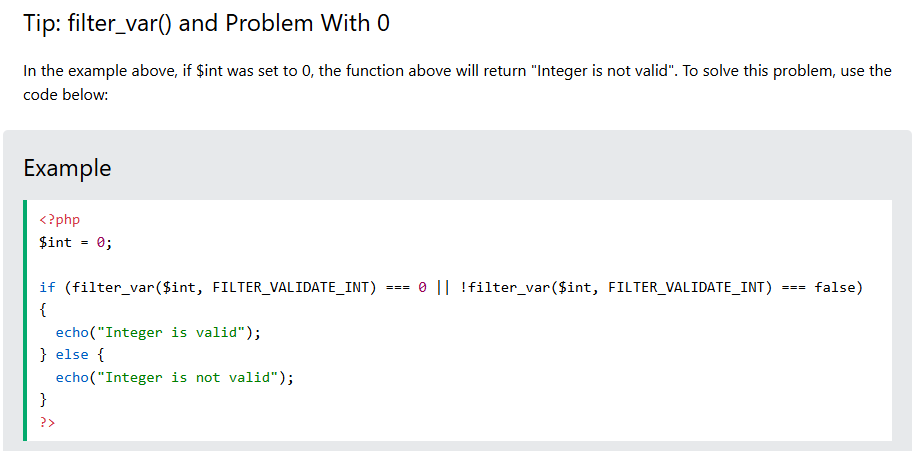

# Learn PHP

## Data Types

string (text values)
int (whole numbers)
float (decimal numbers)
bool (true or false)
array (multiple values)
object (stores data as objects)
null (empty variable)
resource (references external resources)

- var_dump("adf"); // string(3) 

There are three main numeric types in PHP:

Integer
Float
Numeric Strings
In addition, PHP has two more data types used for numbers:

Infinity
NaN

in built PHP_?? a macros? predefined constants??
For very large integers, use BCMath or GMP extensions

## Magic Constants

__CLASS__	If used inside a class, the class name is returned.	
__DIR__	The directory of the file.	
__FILE__	The file name including the full path.	
__FUNCTION__	If inside a function, the function name is returned.	
__LINE__	The current line number of the file.	
__METHOD__	If used inside a function that belongs to a class, both class and function name is returned.	
__NAMESPACE__	If used inside a namespace, the name of the namespace is returned.	
__TRAIT__	If used inside a trait, the trait name is returned.	
ClassName::class	Returns the name of the specified class and the name of the namespace, if any.	


## : in php

```php
if ($x > 0):
    echo "Positive";
    echo "Number";
else:
    echo "Non-positive";
endif;
```

```php
$i = 1;
while ($i < 6):
  echo $i;
  $i++;
endwhile;
```

## reference are string in php

```php
$colors = array("red", "green", "blue", "yellow");

foreach ($colors as $value) {
  echo "$value <br>";
}

$colors = array("red", "green", "blue", "yellow");

foreach ($colors as &$x) { // by reference
  if ($x == "blue") $x = "pink";
}
```

```php
$members = array("Peter"=>"35", "Ben"=>"37", "Joe"=>"43");

foreach ($members as $key => $value) {
  echo "$key : $value <br>";
}
```

```php
$colors = array("red", "green", "blue", "yellow");

foreach ($colors as $x) :
  echo "$x <br>";
endforeach;
```

## pass by ref

```php
function add_five(&$value) {
  $value += 5;
}
```

## variadic

```php
function sumMyNumbers(...$x) {
  $n = 0;
  $len = count($x);
  for($i = 0; $i < $len; $i++) {
    $n += $x[$i];
  }
  return $n;
}

$a = sumMyNumbers(5, 2, 6, 2, 7, 7);
echo $a;
```

- You can only have one argument with variable length, and it has to be the last argument.

- can also iterator on object

## Strict

- To specify strict mode, we need to set declare(strict_types=1);. This must be on the very first line of the PHP file.

```php
<?php declare(strict_types=1); // strict requirement

function addNumbers(float $a, float $b) : float {
  return $a + $b;
}
echo addNumbers(1.2, 5.2);
?>
```

## Array

- `$cars = array("Volvo", "BMW", "Toyota");`
- `$fruits = ["Apple", "Banana", "Cherry"];`

### add items to array

[] - adds a single item to the end of an array
array_push() - adds one or more items to the end of an array
array_unshift() - adds one or more items to the beginning of an array
array_splice() - removes a portion of an array and replaces it with new elements
array_merge() - merges two or more arrays

## Superglobals

$GLOBALS - An array that contains references to all global variables of the script
$_SERVER - Holds information about the web server including headers, paths, and script locations
$_REQUEST - An array containing data from $_GET, $_POST, and $_COOKIE superglobals
$_POST - An array of variables received via the HTTP POST method
$_GET - An array of variables received via the HTTP GET method
$_FILES - An array of items uploaded to the current script via the HTTP POST method (filename, type, size)
$_ENV - Holds environment variables passed to the current script
$_COOKIE - An array of variables passed to the current script via HTTP Cookies
$_SESSION - An array of session variables

## security

- htmlspecialchars() what are these
- trim()
- stripslashes()
- empty()
- filter_var($email, FILTER_VALIDATE_EMAIL)
- isset()
- XSS attacks?
- Cross-site Scripting attack?
- csrf attacks?

## tools

php-cli
php-mysql	Connect to MySQL / MariaDB databases (mysqli or PDO)
php-curl	Make HTTP requests (curl_* functions)
php-gd	Image creation/manipulation
php-xml	Parse XML
php-mbstring	Multibyte string functions (UTF-8 etc.)

## RegEx

- "/pattern/modifiers"
- delimiters - charcters that enclose the pattern (e.g. /)
- pattern - the character sequence to search for
- modifiers - how the search is performed (e.g. i indicates a case-insensitive search)
- The delimiter can be any character that is not a letter, number, backslash or space. The most common delimiter is the forward slash (/), but when your pattern contains forward slashes it is convenient to choose other delimiters such as # or ~
- Quantifiers?
- Grouping?

## functions of regex

preg_match() - Returns 1 if the pattern was found in the string and 0 if not
preg_match_all() - Returns the number of times the pattern was found in the string
preg_replace() - Returns a new string where the matched patterns is replaced with another string
preg_split() - Splits a string into an array using matches of a regular expression as separators
preg_grep() - Returns an array containing only elements from the input that match the given pattern

## Date and Time

date(format, timestamp) - formats a local date and/or a time
mktime(hour, minute, second, month, day, year) - returns the Unix timestamp for a date
strtotime() - converts an English textual datetime string into a Unix timestamp
time() - returns the current time as a Unix timestamp
date_default_timezone_set() - sets the default timezone to be used
date_default_timezone_get() - gets the default timezone

```php
<?php
echo "Today is " . date("Y/m/d") . "<br>";
echo "Today is " . date("Y.m.d") . "<br>";
echo "Today is " . date("Y-m-d") . "<br>";
echo "Today is " . date("l"). "<br>";
echo date('l, F j, Y');
?>
&copy; 2010-<?php echo date("Y");?>
```

```php
<?php
$startdate = strtotime("Saturday");
$enddate = strtotime("+6 weeks", $startdate);

while ($startdate < $enddate) {
  echo date("M d", $startdate) . "<br>";
  $startdate = strtotime("+1 week", $startdate);
?>
```

## Modular

include will produce a warning (E_WARNING) but the script will continue
require will produce a fatal error (E_ERROR) and the script will stop

## File handling

readfile() - reads a file and writes it to the output buffer
fopen() - opens a file (gives you more options than the readfile() function)
fread() - reads from a file
fgets() - reads a single line from a file
fgetc() - reads a single character from a file
feof() - checks if the "end-of-file" (EOF) has been reached
fwrite() - writes to a file
fclose() - closes an open file
unlink() - deletes a file
filesize()

### modes

r	Read only. File pointer starts at the beginning of the file
r+	Read/Write. File pointer starts at the beginning of the file. Existing data is preserved
w	Write only. Erases the contents of the file, or creates a new file if it doesn't exist. File pointer starts at the beginning of the file
w+	Read/Write. Erases the contents of the file, or creates a new file if it doesn't exist. File pointer starts at the beginning of the file
a	Append (write only). The existing data in file is preserved. File pointer starts at the end of the file. Creates a new file if the file doesn't exist
a+	Append (read/write). The existing data in file is preserved. File pointer starts at the end of the file. Creates a new file if the file doesn't exist
x	Write only. Creates a new file. Returns FALSE and an error if file already exists
x+	Read/Write. Creates a new file. Returns FALSE and an error if file already exists

- `$myfile = fopen("webdictionary.txt", "r") or die("Error: Unable to open file!");` or die()??

## File upload

- In your "php.ini" file, search for the file_uploads directive, and set it to On

```php
file_uploads = On
```

```php
<!DOCTYPE html>
<html>
<body>

<form action="upload.php" method="post" enctype="multipart/form-data">
  Select image to upload:
  <input type="file" name="fileToUpload" id="fileToUpload">
  <input type="submit" value="Upload Image" name="submit">
</form>

</body>
</html>
```

```php
<?php
$target_dir = "uploads/";
$target_file = $target_dir . basename($_FILES["fileToUpload"]["name"]);
$uploadOk = 1;
$imageFileType = strtolower(pathinfo($target_file,PATHINFO_EXTENSION));
// Check if image file is a actual image or fake image
if(isset($_POST["submit"])) {
  $check = getimagesize($_FILES["fileToUpload"]["tmp_name"]);
  if($check !== false) {
    echo "File is an image - " . $check["mime"] . ".";
    $uploadOk = 1;
  } else {
    echo "File is not an image.";
    $uploadOk = 0;
  }
}
?>
```

```php
// Check if file already exists
if (file_exists($target_file)) {
  echo "Sorry, file already exists.";
  $uploadOk = 0;
}
```

```php
// Check file size (limit size)
if ($_FILES["fileToUpload"]["size"] > 500000) {
  echo "Sorry, your file is too large.";
  $uploadOk = 0;
}
```

```php
// Allow certain file formats
if($imageFileType != "jpg" && $imageFileType != "png" && $imageFileType != "jpeg"
&& $imageFileType != "gif" ) {
  echo "Sorry, only JPG, JPEG, PNG & GIF files are allowed.";
  $uploadOk = 0;
}
```

```php
// Check if $uploadOk is set to 0 by an error
if ($uploadOk == 0) {
  echo "Sorry, your file was not uploaded.";
// if everything is ok, try to upload file
} else {
  if (move_uploaded_file($_FILES["fileToUpload"]["tmp_name"], $target_file)) {
    echo "The file ". htmlspecialchars( basename( $_FILES["fileToUpload"]["name"])). " has been uploaded.";
  } else {
    echo "Sorry, there was an error uploading your file.";
  }
}
```

- basename()
- htmlspecialchars()
- file_exists()
- $_FILES
- getimagesize()
- strtolower()
- pathinfo()

## API requests in php

1. cURL (built in library)
2. file_get_contents($url)
3. Guzzle (third party library)

### examples

```php
// cURL

// GET
<?php
$url = "https://api.example.com/data";

$ch = curl_init($url);
curl_setopt($ch, CURLOPT_RETURNTRANSFER, true);

$response = curl_exec($ch);
$httpCode = curl_getinfo($ch, CURLINFO_HTTP_CODE);

curl_close($ch);

echo $response;

// POST
<?php
$url = "https://api.example.com/login";

$data = [
    "email" => "test@example.com",
    "password" => "secret"
];

$ch = curl_init($url);
curl_setopt_array($ch, [
    CURLOPT_RETURNTRANSFER => true,
    CURLOPT_POST => true,
    CURLOPT_HTTPHEADER => [
        "Content-Type: application/json"
    ],
    CURLOPT_POSTFIELDS => json_encode($data)
]);

$response = curl_exec($ch);
curl_close($ch);

echo $response;
```

```php
// file_get_contains();

// GET
<?php
$response = file_get_contents("https://api.example.com/data");
echo $response;

// POST
<?php
$options = [
    "http" => [
        "method" => "POST",
        "header" => "Content-Type: application/json",
        "content" => json_encode(["name" => "John"])
    ]
];

$context = stream_context_create($options);
$response = file_get_contents("https://api.example.com", false, $context);

echo $response;
```

```php
// Guzzle

// GET
use GuzzleHttp\Client;

$client = new Client();

$response = $client->post("https://api.example.com/login", [
    "json" => [
        "email" => "test@example.com",
        "password" => "secret"
    ]
]);

echo $response->getBody();

// POST
use GuzzleHttp\Client;

$client = new Client();

$response = $client->post("https://api.example.com/login", [
    "json" => [
        "email" => "test@example.com",
        "password" => "secret"
    ]
]);

echo $response->getBody();

```

## Cookies

A cookie is a small text file that the server stores in the user's web browser. The cookie is then sent along with each HTTP request to the server.

Cookies are ideal for storing information that can be retrieved later. Here are some examples:

- Username
- Maintain login status
- Shopping cart contents
- Language preferences
- Track user activity

`setcookie(name, value, expire, path, domain, secure, httponly);`

Only the name parameter is required. All other parameters are optional.

- name - Required. Specifies the name of the cookie
- value - Optional. Specifies the value of the cookie
- expire - Optional. Specifies when the cookie expires
- path - Optional. Specifies the server path of the cookie
- domain - Optional. Specifies the domain name of the cookie
- secure - Optional. Specifies whether or not the cookie should only be transmitted over a secure HTTPS connection
- httponly - Optional. If set to TRUE the cookie will be accessible only through the HTTP protocol

- The setcookie() function must appear BEFORE the <html> tag, since cookies are a part of the HTTP header.
- To retrieve the value of a cookie, use the superglobal variable $_COOKIE.
- to delete a cookie, use the setcookie() function with an expiration time in the past: `setcookie("username", "", time() - 3600)`

## Session

Session variables hold information about one single user, and are available through all pages in one application.

When you work with an application, you open it, do some changes, and then you close it. This is much like a Session. The computer knows who you are. It knows when you start the application and when you close it. But on the internet there is one problem: the web server does not know who you are or what you do, because the HTTP address doesn't maintain state.

Session variables solve this problem by storing user information to be used across multiple pages (e.g. user logins, shopping carts, etc).

By default, session variables last until the user closes the browser.

The most important session functions are:

- session_start() - Starts a new session
- $_SESSION - Stores and access session variables
- unset() - Removes a specific session variable (e.g unset($_SESSION["favcolor"]))
- session_destroy() - Destroys all data associated with the current session
- session_unset() - Frees all session variables

- Note: The session_start() function must be callled at the beginning of every PHP script, before any HTML output or whitespace!

When a user visits a page that calls the session_start() function, PHP checks for an existing session ID in the user's browser. If no session ID is found, PHP generates a unique, random ID.

This ID (stored in a cookie named PHPSESSID) is the only piece of information stored on the client side. The session data is stored securely on the server, typically in a temporary file.

On the next page load, the server gets the session ID from the cookie and uses it to load the session data into the PHP superglobal $_SESSION. The session data is then available to the current script in all scopes.

### Secure logout

```php
// 1. Initialize the session
session_start();

// 2. Unset all variables (Clear RAM)
$_SESSION = array(); // Same as session_unset()

// 3. Kill the cookie on the browser (Crucial!)
if (ini_get("session.use_cookies")) {
    $params = session_get_cookie_params();
    setcookie(session_name(), '', time() - 42000,
        $params["path"], $params["domain"],
        $params["secure"], $params["httponly"]
    );
}

// 4. Destroy the storage file
session_destroy();
```

## OOPS

```php
<?php
class Fruit {
  // Properties
  public $name;
  public $color;

  // Method to set the properties
  function set_details($name, $color) {
    $this->name = $name;
    $this->color = $color;
  }

  // Method to display the properties
  function get_details() {
    echo "Name: " . $this->name . ". Color: " . $this->color .".<br>";
  }
}
?>

// Create an object named $apple from the Fruit class
$apple = new Fruit();
$apple->set_details('Apple', 'Red'); // Set property values
$apple->get_details(); // Get output
```

```php
// use the instanceof keyword to check if an object belongs to a specific class:

$apple = new Fruit();
var_dump($apple instanceof Fruit);
```

- The PHP __construct() function is a special method within a class that is automatically called each time a new object is created from a class (with the new keyword).

```php
function __construct($name, $color) {
  $this->name = $name;
  $this->color = $color;
}
```

- The PHP __destruct() function is a special method within a class that is automatically called when an object is destroyed or when the script finishes execution.

```php
function __destruct() {
  echo "Name: " . $this->name . ". Color: " . $this->color .".<br>";
}
```

Properties and methods can have access modifiers (or visibility keywords) which control where they can be accessed.

In PHP, there are three access modifiers:

- public - the property or method can be accessed from everywhere. This is default
- protected - the property or method can be accessed within the class and by classes derived from that class
- private - the property or method can ONLY be accessed within the same class where they are defined

- Note: If no acces modifier is specified, it will be set to public.

```php
class Apple extends Fruit {
  public function getType() {
    echo "Name: " . $this->name . ".";
  }
}
```

- The final keyword can be used to prevent class inheritance or to prevent method overriding.
- A class constant is declared inside a class with the const keyword.

```php
final class Hi {
  final public function say() {};
}

// outside the class
class Goodbye {
  const MESSAGE = "Thank you for visiting W3Schools.com!";
}

echo Goodbye::MESSAGE; // Access constant

// inside the class
class Goodbye {
  const MESSAGE = "Thank you for visiting W3Schools.com!";

  public function bye() {
    echo self::MESSAGE; // Access constant
  }
}

$goodbye = new Goodbye();
$goodbye->bye();
```

- An abstract class is a class that contains at least one abstract method. An abstract method is a method that is declared, but not implemented in the abstract class. The implementation must be done in the child class(es).

The purpose of an abstract class is to enforce all derived classes (child classes) to implement the abstract method(s) declared in the parent class.

An abstract class or method is defined with the abstract keyword.

```php
// Abstract base class
abstract class Car {
  public $name;

  // Non-abstract method
  public function __construct($name) {
    $this->name = $name;
  }

  // Abstract method - forces child classes to implement it
  abstract public function intro();
}

// Child class that extends the abstract class
class Audi extends Car {
  public function intro() {
    return "German quality! I'm an $this->name!";
  }
}
```

So, when a child class is inherited from an abstract class, we have the following rules:

- The child class method must be defined with the same name and it redeclares the parent abstract method
- The child class method must be defined with the same or a less restricted access modifier
- The number of required arguments must be the same. However, the child class may have optional arguments in addition

An Interface lets you define which public methods a class MUST implement, without defining how they should be implemented.

Interfaces are declared with the interface keyword, and the methods declared in an interface must be public

```php
interface InterfaceName {
  public function method1();
  public function method2();
}
```

To implement an interface, a class must use the implements keyword.

A class that implements an interface must implement all of the interface's methods.

```php
class ClassName implements InterfaceName{
  public function method1() { 
    // some code
  } 
  public function method2(){ 
    // some code
  } 
}
```

Interface are similar to abstract classes. The difference between interfaces and abstract classes are:

- Interfaces cannot have properties, while abstract classes can
- All interface methods must be public, while abstract methods can be public or protected
- All methods in an interface are abstract, so they cannot be implemented in code and the abstract keyword is not necessary
- Classes can implement an interface while inheriting from another class at the same time
- Interfaces make it easy to use a variety of different classes in the same way. When one or more classes use the same interface, it is referred to as "polymorphism". 

## Traits

Traits are used to declare methods that can be used in multiple classes. Traits can have methods and abstract methods that can be used in multiple classes, and the methods can have any access modifier (public, private, or protected).

Traits allow you to reuse several methods freely in different classes, and are a mechanism for code reuse.

```php
// define trait
trait TraitName {
  // some code...
}

// use trait
class MyClass {
  use TraitName;
}
```

```php
<?php
// Define a trait
trait message1 {
  public function msg1() {
    echo "PHP OOP is fun! ";
  }
}

// Use the trait in a class
class Welcome {
  use message1;
}

$obj = new Welcome();
$obj->msg1();
?>
```

- can trait access class properties?

- The static keyword is used to create static methods and properties.

Static methods can be accessed directly - without creating an instance of the class first.

```php
class ClassName {
  public static function staticMethod() {
    echo "Hello World!";
  }
}

ClassName::staticMethod();
```

A class can have both static and non-static methods. A static method can be accessed from a method in the same class using the self keyword and double colon (::):

```php
<?php
class greeting {
  // static method
  public static function welcome() {
    echo "Hello World!";
  }

  // non-static method
  public function __construct() {
    self::welcome();
  }
}

new greeting();
?>
```

To call a static method from a child class, use the parent keyword inside the child class. Here, the static method can be public or protected.

```php
<?php
class domain {
  protected static function getWebsiteName() {
    return "W3Schools.com";
  }
}

class domainW3 extends domain {
  public $websiteName;
  public function __construct() {
    $this->websiteName = parent::getWebsiteName();
  }
}

$domainW3 = new domainW3;
echo $domainW3 -> websiteName;
?>
```

- Static properties can be accessed directly - without creating an instance of a class first.

```php
class ClassName {
  public static $statProp = "W3Schools";
}

ClassName::$statProp;
```

## Namespace

PHP namespaces are used to prevent naming conflicts between classes, interfaces, functions, and constants.

Namespaces are used to group related code together under a name - to avoid naming conflicts when your code grows, or when you use code from multiple sources.

Namespaces must be declared at the beginning of a PHP file, using the namespace keyword, followed by a name for the namespace.

```php
namespace Html;
```

- The namespace declaration must be the very first thing in the PHP file! The following code is invalid
- All classes, interfaces, functions, and constants declared in this PHP file will now belong to the Html namespace

```php
namespace Html;
class Table {
  public $title = "";
  public $rows = 0;
  public function info() {
    echo "<p>$this->title has $this->rows rows.</p>";
  }
}

$table = new \Html\Table();
$table->title = "My table";
$table->rows = 5;
```

- possible to have nested namespaces

```php
namespace Code\Html;
```

```php
// using namespace
use Html as H;
$table = new H\Table();
```

## PHP Iterables

- an iterable is a value that can be looped through with a foreach() loop.

The iterable pseudo-type was introduced in PHP 7.1, and it can be used as a data type for function arguments and function return values.

An iterable can be an array or an object that implements the Iterator interface.

```php
function printIterable(iterable $x) {
  foreach($x as $item) {
    echo $item;
  }
}

// Called with an array:
printIterable(["a", "b", "c"]);

// Called with an object:
$iterator = new ArrayIterator(["d", "e", "f"]);
printIterable($iterator);

function getIterable():iterable {
  return ["a", "b", "c"];
}

foreach(getIterable() as $item) {
  echo $item;
}
```

### Creating Iterables

- All arrays are iterables, so any array can be used as an argument of a function that requires an iterable.
- Any object that implements the Iterator interface can be used as an argument of a function that requires an iterable.

An iterator contains a list of items and provides methods to loop through them. It keeps a pointer to one of the elements in the list. Each item in the list should have a key which can be used to find the item.

An iterator must have these methods:

- current() - Returns the element that the pointer is currently pointing to. It can be any data type
- key() Returns the key associated with the current element in the list. It can only be an integer, float, boolean or string
- next() Moves the pointer to the next element in the list
- rewind() Moves the pointer to the first element in the list
- valid() If the internal pointer is not pointing to any element (for example, if next() was called at the end of the li
st), this should return false. It returns true in any other case

```php
// Create an Iterator
class MyIterator implements Iterator {
  private $items = [];
  private $pointer = 0;

  public function __construct($items) {
    // array_values() makes sure that the keys are numbers
    $this->items = array_values($items);
  }

  public function current() {
    return $this->items[$this->pointer];
  }

  public function key() {
    return $this->pointer;
  }

  public function next() {
    $this->pointer++;
  }

  public function rewind() {
    $this->pointer = 0;
  }

  public function valid() {
    // count() indicates how many items are in the list
    return $this->pointer < count($this->items);
  }
}

// A function that uses iterables
function printIterable(iterable $myIterable) {
  foreach($myIterable as $item) {
    echo $item;
  }
}

// Use the iterator as an iterable
$iterator = new MyIterator(["a", "b", "c"]);
printIterable($iterator);
```

## Filter

PHP filters are used to validate and sanitize insecure external input (like user-inputs from forms, cookies, web services, or database queries).

Validating data = Checks if the data is in proper form (e.g. valid email format, URL, integer, etc).

Sanitizing data = Removes any illegal character from the data.

- filter_var(var, filter, options); - Filters a single variable with a specified filter
- filter_input() - Gets an external variable (e.g. from form input) and filters it
- filter_var_array() - Filters multiple external variables (an array) and filters them
- filter_list() - Lists all supported filter names and ids

### Validation filters: These filters will check if the data meets specific criteria, but do not change the data itself. It will return false if data is invalid.

- FILTER_VALIDATE_EMAIL
- FILTER_VALIDATE_URL
- FILTER_VALIDATE_INT
- FILTER_VALIDATE_IP

### Sanitization filters: These filters will remove illegal characters from the data, and may alter the input.

- FILTER_SANITIZE_EMAIL (removes illegal email characters)
- FILTER_SANITIZE_URL (removes illegal URL characters)
- FILTER_SANITIZE_NUMBER_INT (removes all characters except digits and + - signs)



- `filter_var($int, FILTER_VALIDATE_INT, array("options" => array("min_range"=>$min, "max_range"=>$max)))`
- `filter_var($ip, FILTER_VALIDATE_IP, FILTER_FLAG_IPV6)`
- `filter_var($url, FILTER_VALIDATE_URL, FILTER_FLAG_QUERY_REQUIRED)`
- `filter_var($str, FILTER_SANITIZE_STRING, FILTER_FLAG_STRIP_HIGH)`


## Callback

A callback function is a function that is passed as an argument into another function.

A callback function can be:

- A named function - pass the function name as a string
- An anonymous function - define a function inline, and pass it as an argument

```php
// Define the named callback function
function myfunction($n) {
  return($n * $n);
}

// Array of numbers to multiply
$numbers = [1, 2, 3, 4, 5];

// Use array_map with the myfunction function as a callback
print_r(array_map("myfunction", $numbers));

$numbers = [1, 2, 3, 4, 5];
$res = array_map(function($n) {return($n * $n);}, $numbers);
print_r($res);
```

### User Defined

```php
<?php
function exclaim($str) {
  return $str . "! ";
}

function ask($str) {
  return $str . "? ";
}

function printFormatted($str, $format) {
  echo $format($str);
}

// Pass "exclaim" and "ask" as callback functions to printFormatted()
printFormatted("Hello world", "exclaim");
printFormatted("Hello world", "ask");
?>
```

- the callback is passed as a string ("exclaim"), but technically, a callback in PHP is a special data type called a callable

a callable in PHP can be three things:

- A String: Referring to a standard function (e.g., "exclaim").
- An Array: Referring to a method inside an Object or Class (e.g., [$myObject, 'methodName']).
- A Closure / Anonymous Function: A function written directly without a name (e.g., function($str) { ... }).

```php
// Add 'callable' before the variable name
function printFormatted($str, callable $format) {
    echo $format($str);
}

function printFormatted($str, $format) {
    // Check if the variable can be called as a function
    if (is_callable($format)) {
        echo $format($str);
    } else {
        echo "Error: '{$format}' is not a valid function name!";
    }
}

// You don't even need to define "exclaim" globally
printFormatted("Hello world", function($str) {
    return $str . "!!!";
});
```

## JSON

JSON stands for JavaScript Object Notation, and is a syntax for storing and exchanging data.

Since the JSON format is a text-based format, it can easily be sent to and from a server, and used as a data format by any programming language.

- json_encode() function is used to encode a value to JSON format.
- json_decode() function is used to decode a JSON object into a PHP object or an associative array.

- json_decode() function returns an object by default. The function has a second parameter, and when set to true, JSON objects are decoded into associative arrays.

```php
$age = array("Peter"=>35, "Ben"=>37, "Joe"=>43)
echo json_encode($age);

$jsonobj = '{"Peter":35,"Ben":37,"Joe":43}';
var_dump(json_decode($jsonobj)); // object
var_dump(json_decode($jsonobj, true)); // associative array
```

## Exceptions

An exception is an unwanted or unexpected event that occurs during the execution of a PHP script.

Exceptions are thrown by many PHP functions and classes (if an unexpected situation arises, such as invalid data). When an exception is thrown, it can be caught by a block of code (usually a try...catch block) with proper error handling. If an exception is not caught, it will be handled by the default exception handler and often results in a fatal error and script termination.

PHP uses the following keywords for exception handling:

- throw - This keyword is used to throw exceptions.
- try - This keyword is used to create a try...catch, or a try...catch...finally statement.
- catch - This keyword is used to handle exceptions that are thrown by the code in a preceding try block.
- finally - This keyword is used in try...finally and try...catch...finally to run a block of code whether or not an exception occurred.

```php
try {
  // code that can throw an exception
} catch(Exception $e) {
  // code to run when an exception is caught
} finally {
  // code that always runs regardless of exception
}
```

```php
function divide($x, $y) {
  if($y == 0) {
    throw new Exception("Cannot divide by zero.");
  }
  return $x / $y;
}

try {
  echo divide(5, 0);
} catch(Exception $e) {
  $file = $e->getFile();
  $line = $e->getLine();
  $code = $e->getCode();
  $message = $e->getMessage();
  echo "Exception thrown in $file on line $line: [Code $code] $message";
} finally {
  echo '<br>Process complete.';
}
```

- `new Exception(message, code, previous)` - Exception Object contains information about the unexpected behaviour the function encountered


- message	Optional. A string describing why the exception was thrown
- code	Optional. An integer that can be used to easily distinguish this exception from others of the same type
- previous	Optional. If this exception was thrown in a catch block of another exception, it is recommended to pass that exception into this parameter

Method	Description

- getMessage()	Returns a string describing why the exception was thrown
- getPrevious()	If the exception was triggered by another one, this method returns the previous exception
- getCode()	Returns an integer which can be used to identify the exception
- getFile()	Returns the absolute path to the file where the exception occured
- getLine()	Returns the line number of the code that threw the exception

## Other

## PHP XML ??? Later

## PHP MySQL ?? Later

## PHP AJAX

- AJAX is about updating parts of a web page, without reloading the whole page.

AJAX = Asynchronous JavaScript and XML.

AJAX is a technique for creating fast and dynamic web pages.

AJAX allows web pages to be updated asynchronously by exchanging small amounts of data with the server behind the scenes. This means that it is possible to update parts of a web page, without reloading the whole page.

Classic web pages, (which do not use AJAX) must reload the entire page if the content should change.

Examples of applications using AJAX: Google Maps, Gmail, Youtube, and Facebook tabs.


AJAX is based on internet standards, and uses a combination of:

- XMLHttpRequest object (to exchange data asynchronously with a server)
- JavaScript/DOM (to display/interact with the information)
- CSS (to style the data)
- XML (often used as the format for transferring data)

AJAX applications are browser- and platform-independent!

- AJAX was made popular in 2005 by Google, with Google Suggest.

- we can directly return html instead of json

## XMLHttpRequest ?? later

## fetch()

## File handling

## Questions

- `**object(stdClass)#1** (3) { ["Peter"]=> int(35) ["Ben"]=> int(37) ["Joe"]=> int(43) }` ??

```html
<select name="users" onchange="showUser(this.value)">
  <option value="">Select a person:</option>
  <option value="1">Peter Griffin</option>
    <option value="2">Lois Griffin</option>
    <option value="3">Joseph Swanson</option>
    <option value="4">Glenn Quagmire</option>
    </select>
</form>
```

- $xmlDoc = new DOMDocument(); $xmlDoc->load("cd_catalog.xml");?

- AJAX Live Search
  - Results are shown as you type
  - Results narrow as you continue typing
  - If results become too narrow, remove characters to see a broader result

## Examples

- [visit](https://www.w3schools.com/php/php_examples.asp)

## FTP and HTTP, REST, Soap, websocket, graph ???

## Reference

PHP Overview
PHP Array !!!!!!!!!!!!!!!!!!
PHP Calendar
PHP Date
PHP Directory
PHP Error !!!!!!!
PHP Exception
PHP Filesystem !!!!!!
PHP Filter !!!!!
PHP FTP !!!!!!
PHP JSON !!!!!!!!!
PHP Keywords
PHP Libxml
PHP Mail !!!!!!!!!
PHP Math !!!!!!!!
PHP Misc
PHP MySQLi !!!!!!!!!!
PHP Network !!!!!!!!!!!
PHP Output Control
PHP RegEx !!!!!!!!!!
PHP SimpleXML
PHP Stream !!!!!!!!!!
PHP String
PHP Variable Handling
PHP XML Parser
PHP Zip !!!!!!!!!!
PHP Timezones !!!!!!!
PHP PDO !!!!!!!!!!!!!111

```php
//upload.php

<?php
$target_dir = "uploads/";
$target_file = $target_dir . basename($_FILES["fileToUpload"]["name"]);
$uploadOk = 1;
$imageFileType = strtolower(pathinfo($target_file,PATHINFO_EXTENSION));

// Check if image file is a actual image or fake image
if(isset($_POST["submit"])) {
  $check = getimagesize($_FILES["fileToUpload"]["tmp_name"]);
  if($check !== false) {
    echo "File is an image - " . $check["mime"] . ".";
    $uploadOk = 1;
  } else {
    echo "File is not an image.";
    $uploadOk = 0;
  }
}

// Check if file already exists
if (file_exists($target_file)) {
  echo "Sorry, file already exists.";
  $uploadOk = 0;
}

// Check file size
if ($_FILES["fileToUpload"]["size"] > 500000) {
  echo "Sorry, your file is too large.";
  $uploadOk = 0;
}

// Allow certain file formats
if($imageFileType != "jpg" && $imageFileType != "png" && $imageFileType != "jpeg"
&& $imageFileType != "gif" ) {
  echo "Sorry, only JPG, JPEG, PNG & GIF files are allowed.";
  $uploadOk = 0;
}

// Check if $uploadOk is set to 0 by an error
if ($uploadOk == 0) {
  echo "Sorry, your file was not uploaded.";
// if everything is ok, try to upload file
} else {
  if (move_uploaded_file($_FILES["fileToUpload"]["tmp_name"], $target_file)) {
    echo "The file ". htmlspecialchars( basename( $_FILES["fileToUpload"]["name"])). " has been uploaded.";
  } else {
    echo "Sorry, there was an error uploading your file.";
  }
}
?>

```


```php
// oop.php

<?php

class Fruit {
    public $name;
    public $color;

    function __construct($n, $c) {
        $this->name = $n;
        $this->color = $c;
    }

    function __destruct() {
        echo "Name: " . $this->name . ". Color: " . $this->color . ".<br>";
    }
}

$fruit = new Fruit("Mango", "Yellow");
echo "destroyed ";

var_dump(Fruit::class);

```

```php
<!DOCTYPE html>
<html>
<body>

<form action="upload.php" method="post" enctype="multipart/form-data">
  Select image to upload:
  <input type="file" name="fileToUpload" id="fileToUpload">
  <input type="submit" value="Upload Image" name="submit">
</form>

<table>
  <tr>
    <th>Filter Name</th>
    <th>Filter ID</th>
  </tr>
  <?php
  foreach (filter_list() as $id =>$filter) {
    echo '<tr><td>' . $filter . '</td><td>' . filter_id($filter) . '</td></tr>';
  }
  ?>
</table>

</body>
</html>
```

```php
<?php

$url = "https://jsonplaceholder.typicode.com/posts/1";

// ------------------------

$ch = curl_init($url);
curl_setopt($ch, CURLOPT_RETURNTRANSFER, true);

$response = curl_exec($ch);
$httpCode = curl_getinfo($ch, CURLINFO_HTTP_CODE);

curl_close($ch);

echo $response;

echo "<br>---------------------<br>";


$response = file_get_contents($url);
echo $response;


echo "<br>---------------------<br>";

?>
```
